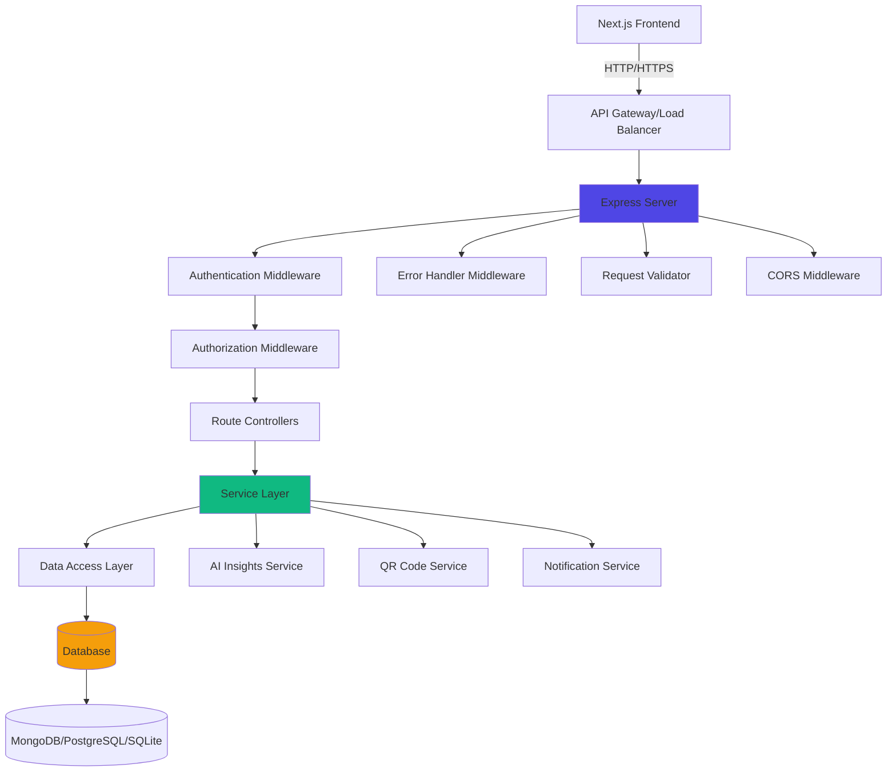
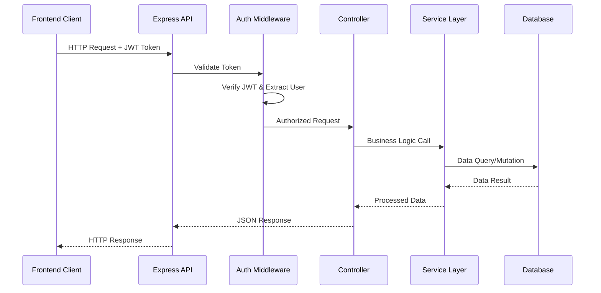

# Design Document: Healthcare Backend API Implementation

## Overview

This document outlines the comprehensive design for a production-ready RESTful backend API for a healthcare application. The system supports role-based access control (admin, doctor, nurse, patient, technician), patient management, care timelines, task assignments, QR code scanning, and AI-powered health insights. The backend is built with Node.js/Express and integrates seamlessly with the existing Next.js frontend.

The architecture follows RESTful principles with structured routing, middleware-based authentication/authorization, comprehensive error handling, and database abstraction for flexibility between MongoDB, PostgreSQL, or SQLite. The design prioritizes security, scalability, and maintainability while ensuring production-readiness.

## Architecture



### Main Workflow Sequence


backend/
├── src/
│   ├── config/
│   │   ├── database.ts          # Database connection configuration
│   │   ├── env.ts                # Environment variables validation
│   │   └── cors.ts               # CORS configuration
│   ├── middleware/
│   │   ├── auth.ts               # JWT authentication middleware
│   │   ├── authorize.ts          # Role-based authorization
│   │   ├── errorHandler.ts       # Global error handler
│   │   ├── validator.ts          # Request validation middleware
│   │   └── rateLimiter.ts        # Rate limiting
│   ├── models/
│   │   ├── User.ts               # User model
│   │   ├── Patient.ts            # Patient model
│   │   ├── Task.ts               # Task model
│   │   ├── Equipment.ts          # Equipment model
│   │   ├── Appointment.ts        # Appointment model
│   │   ├── Notification.ts       # Notification model
│   │   └── AIInsight.ts          # AI Insights model
│   ├── controllers/
│   │   ├── authController.ts     # Authentication endpoints
│   │   ├── userController.ts     # User management
│   │   ├── patientController.ts  # Patient CRUD operations
│   │   ├── taskController.ts     # Task management
│   │   ├── equipmentController.ts # Equipment tracking
│   │   ├── appointmentController.ts # Appointment scheduling
│   │   ├── notificationController.ts # Notifications
│   │   ├── qrController.ts       # QR code operations
│   │   └── aiController.ts       # AI insights
│   ├── services/
│   │   ├── authService.ts        # Authentication business logic
│   │   ├── patientService.ts     # Patient business logic
│   │   ├── taskService.ts        # Task business logic
│   │   ├── aiService.ts          # AI insights generation
│   │   ├── qrService.ts          # QR code generation/validation
│   │   └── notificationService.ts # Notification dispatch
│   ├── routes/
│   │   ├── index.ts              # Route aggregator
│   │   ├── authRoutes.ts         # /api/auth/*
│   │   ├── userRoutes.ts         # /api/users/*
│   │   ├── patientRoutes.ts      # /api/patients/*
│   │   ├── taskRoutes.ts         # /api/tasks/*
│   │   ├── equipmentRoutes.ts    # /api/equipment/*
│   │   ├── appointmentRoutes.ts  # /api/appointments/*
│   │   ├── notificationRoutes.ts # /api/notifications/*
│   │   ├── qrRoutes.ts           # /api/qr/*
│   │   └── aiRoutes.ts           # /api/ai/*
│   ├── utils/
│   │   ├── jwt.ts                # JWT token utilities
│   │   ├── password.ts           # Password hashing utilities
│   │   ├── validation.ts         # Validation schemas
│   │   ├── logger.ts             # Logging utility
│   │   └── response.ts           # Standardized response format
│   ├── types/
│   │   ├── express.d.ts          # Express type extensions
│   │   └── index.ts              # Shared types
│   └── app.ts                    # Express app setup
├── tests/
│   ├── unit/
│   ├── integration/
│   └── e2e/
├── .env.example                  # Environment variables template
├── .gitignore
├── package.json
├── tsconfig.json
└── README.md
```

## Components and Interfaces

### Component 1: Authentication Service

**Purpose**: Handles user authentication, JWT token generation/validation, and session management.

**Interface**:
```typescript
interface IAuthService {
  login(email: string, password: string): Promise<AuthResponse>
  register(userData: RegisterDTO): Promise<User>
  validateToken(token: string): Promise<TokenPayload>
  refreshToken(refreshToken: string): Promise<AuthResponse>
  logout(userId: string): Promise<void>
}

interface AuthResponse {
  user: UserDTO
  accessToken: string
  refreshToken: string
  expiresIn: number
}

interface TokenPayload {
  userId: string
  email: string
  role: UserRole
  iat: number
  exp: number
}
```

**Responsibilities**:
- Validate user credentials against database
- Generate JWT access and refresh tokens
- Verify token signatures and expiration
- Handle token refresh flow
- Manage user sessions

### Component 2: Patient Management Service

**Purpose**: Manages patient records, vital signs, medical history, and risk assessments.

**Interface**:
```typescript
interface IPatientService {
  createPatient(patientData: CreatePatientDTO): Promise<Patient>
  getPatientById(id: string): Promise<Patient>
  updatePatient(id: string, updates: UpdatePatientDTO): Promise<Patient>
  deletePatient(id: string): Promise<void>
  listPatients(filters: PatientFilters, pagination: Pagination): Promise<PaginatedResult<Patient>>
  updateVitals(patientId: string, vitals: VitalSigns): Promise<Patient>
  calculateRiskScore(patientId: string): Promise<RiskAssessment>
  getPatientTimeline(patientId: string): Promise<TimelineEvent[]>
}

interface CreatePatientDTO {
  name: string
  age: number
  gender: 'M' | 'F' | 'Other'
  bloodType: string
  allergies?: string[]
  conditions?: string[]
  primaryDoctor?: string
}

interface RiskAssessment {
  score: number
  level: 'low' | 'medium' | 'high' | 'critical'
  factors: RiskFactor[]
  recommendations: string[]
}
```

**Responsibilities**:
- CRUD operations for patient records
- Vital signs tracking and history
- Risk score calculation based on vitals and conditions
- Patient timeline generation
- Medical record number generation

### Component 3: Task Management Service

**Purpose**: Handles task creation, assignment, tracking, and completion for healthcare staff.

**Interface**:
```typescript
interface ITaskService {
  createTask(taskData: CreateTaskDTO): Promise<Task>
  getTaskById(id: string): Promise<Task>
  updateTask(id: string, updates: UpdateTaskDTO): Promise<Task>
  deleteTask(id: string): Promise<void>
  listTasks(filters: TaskFilters): Promise<Task[]>
  assignTask(taskId: string, userId: string): Promise<Task>
  completeTask(taskId: string, notes?: string): Promise<Task>
  getTasksByUser(userId: string, status?: TaskStatus): Promise<Task[]>
  getTasksByPatient(patientId: string): Promise<Task[]>
}

interface CreateTaskDTO {
  title: string
  description: string
  patientId: string
  assignedTo?: string
  priority: 'low' | 'medium' | 'high' | 'critical'
  dueDate: Date
  type: TaskType
}

type TaskStatus = 'pending' | 'in-progress' | 'completed' | 'cancelled'
type TaskType = 'check-vitals' | 'medication' | 'test' | 'consultation' | 'follow-up'
```

**Responsibilities**:
- Task lifecycle management
- Assignment and reassignment logic
- Priority-based task queuing
- Task completion tracking
- Notification triggers on task events

### Component 4: AI Insights Service

**Purpose**: Generates AI-powered health insights, risk predictions, and clinical recommendations.

**Interface**:
```typescript
interface IAIService {
  analyzePatientRisk(patientId: string): Promise<AIInsight[]>
  generateTaskRecommendations(patientId: string): Promise<AIInsight[]>
  checkMedicationInteractions(medications: Medication[]): Promise<AIInsight[]>
  predictDeterioration(patientId: string): Promise<DeteriorationPrediction>
  generateStaffingInsights(): Promise<AIInsight[]>
}

interface AIInsight {
  id: string
  type: 'risk' | 'recommendation' | 'alert' | 'trend'
  title: string
  message: string
  severity: 'low' | 'medium' | 'high' | 'critical'
  actionable: boolean
  suggestedAction?: string
  confidence: number
}

interface DeteriorationPrediction {
  riskPercentage: number
  timeframe: string
  factors: string[]
  recommendations: string[]
}
```

**Responsibilities**:
- Patient risk analysis based on vitals and history
- Clinical decision support recommendations
- Medication interaction checking
- Patient deterioration prediction
- Staffing optimization insights

### Component 5: QR Code Service

**Purpose**: Generates and validates QR codes for patient and equipment identification.

**Interface**:
```typescript
interface IQRService {
  generatePatientQR(patientId: string): Promise<QRCodeData>
  generateEquipmentQR(equipmentId: string): Promise<QRCodeData>
  validateQR(qrData: string): Promise<QRValidationResult>
  scanQR(qrData: string): Promise<ScanResult>
}

interface QRCodeData {
  type: 'patient' | 'equipment'
  id: string
  qrString: string
  imageUrl: string
  expiresAt?: Date
}

interface QRValidationResult {
  valid: boolean
  data?: {
    type: string
    id: string
    name: string
  }
  error?: string
}
```

**Responsibilities**:
- QR code generation with embedded data
- QR code validation and decryption
- Scan history tracking
- Expired QR code handling

### Component 6: Notification Service

**Purpose**: Manages real-time notifications for users based on events and alerts.

**Interface**:
```typescript
interface INotificationService {
  createNotification(data: CreateNotificationDTO): Promise<Notification>
  getUserNotifications(userId: string, unreadOnly?: boolean): Promise<Notification[]>
  markAsRead(notificationId: string): Promise<void>
  markAllAsRead(userId: string): Promise<void>
  deleteNotification(notificationId: string): Promise<void>
  sendBulkNotifications(userIds: string[], data: NotificationData): Promise<void>
}

interface CreateNotificationDTO {
  userId: string
  title: string
  message: string
  type: 'info' | 'warning' | 'alert' | 'success'
  actionUrl?: string
}
```

**Responsibilities**:
- Notification creation and dispatch
- User notification retrieval
- Read/unread status management
- Bulk notification sending
- Event-driven notification triggers

## Data Models

### Model 1: User

```typescript
interface User {
  id: string
  username: string
  password: string // hashed
  name: string
  email: string
  role: UserRole
  avatar?: string
  department?: string
  specialization?: string
  licenseNumber?: string
  phone?: string
  isActive: boolean
  lastLogin?: Date
  createdAt: Date
  updatedAt: Date
}

type UserRole = 'admin' | 'doctor' | 'nurse' | 'patient' | 'technician'
```

**Validation Rules**:
- Email must be unique and valid format
- Password must be at least 8 characters with complexity requirements
- Role must be one of the defined UserRole values
- Phone must match valid phone number format
- Username must be unique and alphanumeric

**Indexes**:
- Primary: `id`
- Unique: `email`, `username`
- Index: `role`, `department`

### Model 2: Patient

```typescript
interface Patient {
  id: string
  name: string
  age: number
  medicalRecordNumber: string
  gender: 'M' | 'F' | 'Other'
  bloodType: string
  allergies: string[]
  conditions: string[]
  medications: Medication[]
  vitals: VitalSigns
  riskScore?: number
  riskLevel?: 'low' | 'medium' | 'high' | 'critical'
  lastUpdated: Date
  admissionDate?: Date
  primaryDoctor?: string
  assignedNurse?: string
  notes?: string
  qrCode?: string
  createdAt: Date
  updatedAt: Date
}

interface VitalSigns {
  bloodPressure: {
    systolic: number
    diastolic: number
  }
  heartRate: number
  temperature: number
  respiratoryRate: number
  oxygenSaturation: number
  bloodGlucose?: number
  timestamp: Date
}

interface Medication {
  id: string
  name: string
  dosage: string
  frequency: string
  startDate: Date
  endDate?: Date
  prescribedBy: string
  reason: string
}
```

**Validation Rules**:
- Medical record number must be unique
- Age must be between 0 and 150
- Blood type must be valid (A+, A-, B+, B-, AB+, AB-, O+, O-)
- Vital signs must be within medically reasonable ranges
- Primary doctor and assigned nurse must reference valid user IDs

**Indexes**:
- Primary: `id`
- Unique: `medicalRecordNumber`
- Index: `primaryDoctor`, `assignedNurse`, `riskLevel`, `admissionDate`

### Model 3: Task

```typescript
interface Task {
  id: string
  title: string
  description: string
  patientId: string
  assignedTo: string
  priority: 'low' | 'medium' | 'high' | 'critical'
  status: 'pending' | 'in-progress' | 'completed' | 'cancelled'
  type: 'check-vitals' | 'medication' | 'test' | 'consultation' | 'follow-up'
  dueDate: Date
  createdBy: string
  createdAt: Date
  completedAt?: Date
  notes?: string
  updatedAt: Date
}
```

**Validation Rules**:
- Patient ID must reference valid patient
- Assigned to must reference valid user with appropriate role
- Due date must be in the future for new tasks
- Status transitions must follow valid workflow (pending → in-progress → completed)

**Indexes**:
- Primary: `id`
- Index: `patientId`, `assignedTo`, `status`, `priority`, `dueDate`
- Compound: `(assignedTo, status)`, `(patientId, status)`

### Model 4: Equipment

```typescript
interface Equipment {
  id: string
  name: string
  type: string
  location: string
  status: 'available' | 'in-use' | 'maintenance' | 'out-of-service'
  lastMaintenance: Date
  nextMaintenance: Date
  serialNumber: string
  assignedTo?: string
  qrCode?: string
  notes?: string
  createdAt: Date
  updatedAt: Date
}
```

**Validation Rules**:
- Serial number must be unique
- Next maintenance date must be after last maintenance date
- Assigned to must reference valid user when status is 'in-use'

**Indexes**:
- Primary: `id`
- Unique: `serialNumber`
- Index: `status`, `location`, `type`, `nextMaintenance`

### Model 5: Appointment

```typescript
interface Appointment {
  id: string
  patientId: string
  patientName: string
  doctorId: string
  doctorName: string
  dateTime: Date
  duration: number // minutes
  type: string
  status: 'scheduled' | 'completed' | 'cancelled' | 'no-show'
  notes?: string
  createdAt: Date
  updatedAt: Date
}
```

**Validation Rules**:
- Patient ID and doctor ID must reference valid records
- Date time must be in the future for new appointments
- Duration must be positive integer
- No overlapping appointments for same doctor

**Indexes**:
- Primary: `id`
- Index: `patientId`, `doctorId`, `dateTime`, `status`
- Compound: `(doctorId, dateTime)`, `(patientId, dateTime)`

### Model 6: Notification

```typescript
interface Notification {
  id: string
  userId: string
  title: string
  message: string
  type: 'info' | 'warning' | 'alert' | 'success'
  read: boolean
  actionUrl?: string
  createdAt: Date
  readAt?: Date
}
```

**Validation Rules**:
- User ID must reference valid user
- Type must be one of defined notification types
- Read status defaults to false

**Indexes**:
- Primary: `id`
- Index: `userId`, `read`, `createdAt`
- Compound: `(userId, read)`

### Model 7: AIInsight

```typescript
interface AIInsight {
  id: string
  patientId?: string
  type: 'risk' | 'recommendation' | 'alert' | 'trend'
  title: string
  message: string
  severity: 'low' | 'medium' | 'high' | 'critical'
  actionable: boolean
  suggestedAction?: string
  confidence: number
  metadata?: Record<string, any>
  createdAt: Date
  expiresAt?: Date
}
```

**Validation Rules**:
- Confidence must be between 0 and 1
- Severity must be one of defined levels
- Patient ID must reference valid patient if provided

**Indexes**:
- Primary: `id`
- Index: `patientId`, `type`, `severity`, `createdAt`


## API Endpoints Specification

### Authentication Endpoints (`/api/auth`)

#### POST /api/auth/register
**Description**: Register a new user account

**Request Body**:
```typescript
{
  username: string
  email: string
  password: string
  name: string
  role: UserRole
  department?: string
  phone?: string
}
```

**Response** (201):
```typescript
{
  success: true
  data: {
    user: UserDTO
    accessToken: string
    refreshToken: string
  }
}
```

**Errors**: 400 (validation), 409 (email exists)

---

#### POST /api/auth/login
**Description**: Authenticate user and receive tokens

**Request Body**:
```typescript
{
  email: string
  password: string
}
```

**Response** (200):
```typescript
{
  success: true
  data: {
    user: UserDTO
    accessToken: string
    refreshToken: string
    expiresIn: number
  }
}
```

**Errors**: 401 (invalid credentials), 403 (account inactive)

---

#### POST /api/auth/refresh
**Description**: Refresh access token using refresh token

**Request Body**:
```typescript
{
  refreshToken: string
}
```

**Response** (200):
```typescript
{
  success: true
  data: {
    accessToken: string
    expiresIn: number
  }
}
```

**Errors**: 401 (invalid token)

---

#### POST /api/auth/logout
**Description**: Logout user and invalidate tokens

**Headers**: `Authorization: Bearer <token>`

**Response** (200):
```typescript
{
  success: true
  message: "Logged out successfully"
}
```

---

### User Endpoints (`/api/users`)

#### GET /api/users
**Description**: List all users (admin only)

**Headers**: `Authorization: Bearer <token>`

**Query Parameters**:
- `role`: Filter by role
- `department`: Filter by department
- `page`: Page number (default: 1)
- `limit`: Items per page (default: 20)

**Response** (200):
```typescript
{
  success: true
  data: {
    users: UserDTO[]
    pagination: {
      page: number
      limit: number
      total: number
      pages: number
    }
  }
}
```

**Authorization**: Admin only

---

#### GET /api/users/:id
**Description**: Get user by ID

**Headers**: `Authorization: Bearer <token>`

**Response** (200):
```typescript
{
  success: true
  data: UserDTO
}
```

**Errors**: 404 (not found)

**Authorization**: Admin or self

---

#### PUT /api/users/:id
**Description**: Update user information

**Headers**: `Authorization: Bearer <token>`

**Request Body**:
```typescript
{
  name?: string
  email?: string
  phone?: string
  department?: string
  avatar?: string
}
```

**Response** (200):
```typescript
{
  success: true
  data: UserDTO
}
```

**Errors**: 404 (not found), 409 (email conflict)

**Authorization**: Admin or self

---

#### DELETE /api/users/:id
**Description**: Deactivate user account

**Headers**: `Authorization: Bearer <token>`

**Response** (200):
```typescript
{
  success: true
  message: "User deactivated successfully"
}
```

**Authorization**: Admin only

---

### Patient Endpoints (`/api/patients`)

#### POST /api/patients
**Description**: Create new patient record

**Headers**: `Authorization: Bearer <token>`

**Request Body**:
```typescript
{
  name: string
  age: number
  gender: 'M' | 'F' | 'Other'
  bloodType: string
  allergies?: string[]
  conditions?: string[]
  primaryDoctor?: string
  admissionDate?: string
}
```

**Response** (201):
```typescript
{
  success: true
  data: Patient
}
```

**Authorization**: Doctor, Nurse, Admin

---

#### GET /api/patients
**Description**: List patients with filtering and pagination

**Headers**: `Authorization: Bearer <token>`

**Query Parameters**:
- `search`: Search by name or MRN
- `riskLevel`: Filter by risk level
- `primaryDoctor`: Filter by doctor ID
- `assignedNurse`: Filter by nurse ID
- `page`: Page number
- `limit`: Items per page

**Response** (200):
```typescript
{
  success: true
  data: {
    patients: Patient[]
    pagination: PaginationMeta
  }
}
```

**Authorization**: All authenticated users

---

#### GET /api/patients/:id
**Description**: Get patient details by ID

**Headers**: `Authorization: Bearer <token>`

**Response** (200):
```typescript
{
  success: true
  data: Patient
}
```

**Errors**: 404 (not found)

**Authorization**: All authenticated users

---

#### PUT /api/patients/:id
**Description**: Update patient information

**Headers**: `Authorization: Bearer <token>`

**Request Body**:
```typescript
{
  name?: string
  age?: number
  allergies?: string[]
  conditions?: string[]
  medications?: Medication[]
  primaryDoctor?: string
  assignedNurse?: string
  notes?: string
}
```

**Response** (200):
```typescript
{
  success: true
  data: Patient
}
```

**Authorization**: Doctor, Nurse, Admin

---

#### DELETE /api/patients/:id
**Description**: Delete patient record (soft delete)

**Headers**: `Authorization: Bearer <token>`

**Response** (200):
```typescript
{
  success: true
  message: "Patient record deleted"
}
```

**Authorization**: Admin only

---

#### POST /api/patients/:id/vitals
**Description**: Update patient vital signs

**Headers**: `Authorization: Bearer <token>`

**Request Body**:
```typescript
{
  bloodPressure: {
    systolic: number
    diastolic: number
  }
  heartRate: number
  temperature: number
  respiratoryRate: number
  oxygenSaturation: number
  bloodGlucose?: number
}
```

**Response** (200):
```typescript
{
  success: true
  data: {
    patient: Patient
    riskAssessment: RiskAssessment
  }
}
```

**Authorization**: Doctor, Nurse, Technician

---

#### GET /api/patients/:id/timeline
**Description**: Get patient care timeline

**Headers**: `Authorization: Bearer <token>`

**Response** (200):
```typescript
{
  success: true
  data: TimelineEvent[]
}
```

**Authorization**: All authenticated users

---

#### GET /api/patients/:id/risk
**Description**: Get patient risk assessment

**Headers**: `Authorization: Bearer <token>`

**Response** (200):
```typescript
{
  success: true
  data: RiskAssessment
}
```

**Authorization**: Doctor, Nurse, Admin

---

### Task Endpoints (`/api/tasks`)

#### POST /api/tasks
**Description**: Create new task

**Headers**: `Authorization: Bearer <token>`

**Request Body**:
```typescript
{
  title: string
  description: string
  patientId: string
  assignedTo?: string
  priority: 'low' | 'medium' | 'high' | 'critical'
  type: TaskType
  dueDate: string
}
```

**Response** (201):
```typescript
{
  success: true
  data: Task
}
```

**Authorization**: Doctor, Nurse, Admin

---

#### GET /api/tasks
**Description**: List tasks with filtering

**Headers**: `Authorization: Bearer <token>`

**Query Parameters**:
- `status`: Filter by status
- `priority`: Filter by priority
- `assignedTo`: Filter by assigned user
- `patientId`: Filter by patient
- `page`: Page number
- `limit`: Items per page

**Response** (200):
```typescript
{
  success: true
  data: {
    tasks: Task[]
    pagination: PaginationMeta
  }
}
```

**Authorization**: All authenticated users

---

#### GET /api/tasks/:id
**Description**: Get task details

**Headers**: `Authorization: Bearer <token>`

**Response** (200):
```typescript
{
  success: true
  data: Task
}
```

**Authorization**: All authenticated users

---

#### PUT /api/tasks/:id
**Description**: Update task

**Headers**: `Authorization: Bearer <token>`

**Request Body**:
```typescript
{
  title?: string
  description?: string
  assignedTo?: string
  priority?: string
  status?: string
  notes?: string
}
```

**Response** (200):
```typescript
{
  success: true
  data: Task
}
```

**Authorization**: Task creator, assignee, or admin

---

#### POST /api/tasks/:id/complete
**Description**: Mark task as completed

**Headers**: `Authorization: Bearer <token>`

**Request Body**:
```typescript
{
  notes?: string
}
```

**Response** (200):
```typescript
{
  success: true
  data: Task
}
```

**Authorization**: Task assignee or admin

---

#### DELETE /api/tasks/:id
**Description**: Delete task

**Headers**: `Authorization: Bearer <token>`

**Response** (200):
```typescript
{
  success: true
  message: "Task deleted"
}
```

**Authorization**: Task creator or admin

---

### Equipment Endpoints (`/api/equipment`)

#### POST /api/equipment
**Description**: Register new equipment

**Headers**: `Authorization: Bearer <token>`

**Request Body**:
```typescript
{
  name: string
  type: string
  location: string
  serialNumber: string
  lastMaintenance: string
  nextMaintenance: string
}
```

**Response** (201):
```typescript
{
  success: true
  data: Equipment
}
```

**Authorization**: Admin, Technician

---

#### GET /api/equipment
**Description**: List equipment with filtering

**Headers**: `Authorization: Bearer <token>`

**Query Parameters**:
- `status`: Filter by status
- `type`: Filter by type
- `location`: Filter by location
- `page`: Page number
- `limit`: Items per page

**Response** (200):
```typescript
{
  success: true
  data: {
    equipment: Equipment[]
    pagination: PaginationMeta
  }
}
```

**Authorization**: All authenticated users

---

#### GET /api/equipment/:id
**Description**: Get equipment details

**Headers**: `Authorization: Bearer <token>`

**Response** (200):
```typescript
{
  success: true
  data: Equipment
}
```

**Authorization**: All authenticated users

---

#### PUT /api/equipment/:id
**Description**: Update equipment information

**Headers**: `Authorization: Bearer <token>`

**Request Body**:
```typescript
{
  name?: string
  location?: string
  status?: string
  assignedTo?: string
  notes?: string
}
```

**Response** (200):
```typescript
{
  success: true
  data: Equipment
}
```

**Authorization**: Admin, Technician

---

### Appointment Endpoints (`/api/appointments`)

#### POST /api/appointments
**Description**: Schedule new appointment

**Headers**: `Authorization: Bearer <token>`

**Request Body**:
```typescript
{
  patientId: string
  doctorId: string
  dateTime: string
  duration: number
  type: string
  notes?: string
}
```

**Response** (201):
```typescript
{
  success: true
  data: Appointment
}
```

**Authorization**: Doctor, Nurse, Admin

---

#### GET /api/appointments
**Description**: List appointments

**Headers**: `Authorization: Bearer <token>`

**Query Parameters**:
- `patientId`: Filter by patient
- `doctorId`: Filter by doctor
- `status`: Filter by status
- `startDate`: Filter from date
- `endDate`: Filter to date

**Response** (200):
```typescript
{
  success: true
  data: Appointment[]
}
```

**Authorization**: All authenticated users

---

#### PUT /api/appointments/:id
**Description**: Update appointment

**Headers**: `Authorization: Bearer <token>`

**Request Body**:
```typescript
{
  dateTime?: string
  duration?: number
  status?: string
  notes?: string
}
```

**Response** (200):
```typescript
{
  success: true
  data: Appointment
}
```

**Authorization**: Doctor, Admin

---

### Notification Endpoints (`/api/notifications`)

#### GET /api/notifications
**Description**: Get user notifications

**Headers**: `Authorization: Bearer <token>`

**Query Parameters**:
- `unreadOnly`: boolean (default: false)
- `limit`: number (default: 50)

**Response** (200):
```typescript
{
  success: true
  data: Notification[]
}
```

**Authorization**: Self only

---

#### PUT /api/notifications/:id/read
**Description**: Mark notification as read

**Headers**: `Authorization: Bearer <token>`

**Response** (200):
```typescript
{
  success: true
  data: Notification
}
```

**Authorization**: Self only

---

#### PUT /api/notifications/read-all
**Description**: Mark all notifications as read

**Headers**: `Authorization: Bearer <token>`

**Response** (200):
```typescript
{
  success: true
  message: "All notifications marked as read"
}
```

**Authorization**: Self only

---

### QR Code Endpoints (`/api/qr`)

#### POST /api/qr/generate/patient/:patientId
**Description**: Generate QR code for patient

**Headers**: `Authorization: Bearer <token>`

**Response** (200):
```typescript
{
  success: true
  data: QRCodeData
}
```

**Authorization**: Doctor, Nurse, Admin

---

#### POST /api/qr/generate/equipment/:equipmentId
**Description**: Generate QR code for equipment

**Headers**: `Authorization: Bearer <token>`

**Response** (200):
```typescript
{
  success: true
  data: QRCodeData
}
```

**Authorization**: Technician, Admin

---

#### POST /api/qr/scan
**Description**: Scan and validate QR code

**Headers**: `Authorization: Bearer <token>`

**Request Body**:
```typescript
{
  qrData: string
}
```

**Response** (200):
```typescript
{
  success: true
  data: {
    valid: boolean
    type: 'patient' | 'equipment'
    id: string
    name: string
    details: Patient | Equipment
  }
}
```

**Authorization**: All authenticated users

---

### AI Insights Endpoints (`/api/ai`)

#### GET /api/ai/patient/:patientId/insights
**Description**: Get AI-generated insights for patient

**Headers**: `Authorization: Bearer <token>`

**Response** (200):
```typescript
{
  success: true
  data: AIInsight[]
}
```

**Authorization**: Doctor, Nurse, Admin

---

#### GET /api/ai/patient/:patientId/risk-prediction
**Description**: Get patient deterioration prediction

**Headers**: `Authorization: Bearer <token>`

**Response** (200):
```typescript
{
  success: true
  data: DeteriorationPrediction
}
```

**Authorization**: Doctor, Nurse, Admin

---

#### GET /api/ai/patient/:patientId/task-recommendations
**Description**: Get AI task recommendations for patient

**Headers**: `Authorization: Bearer <token>`

**Response** (200):
```typescript
{
  success: true
  data: AIInsight[]
}
```

**Authorization**: Doctor, Nurse, Admin

---

#### POST /api/ai/medication-check
**Description**: Check medication interactions

**Headers**: `Authorization: Bearer <token>`

**Request Body**:
```typescript
{
  medications: Medication[]
}
```

**Response** (200):
```typescript
{
  success: true
  data: AIInsight[]
}
```

**Authorization**: Doctor, Nurse

---

#### GET /api/ai/staffing-insights
**Description**: Get staffing optimization insights

**Headers**: `Authorization: Bearer <token>`

**Response** (200):
```typescript
{
  success: true
  data: AIInsight[]
}
```

**Authorization**: Admin


## Algorithmic Pseudocode

### Main Authentication Algorithm

```typescript
/**
 * Algorithm: User Authentication
 * 
 * Preconditions:
 * - email is non-empty string in valid email format
 * - password is non-empty string
 * - Database connection is established
 * 
 * Postconditions:
 * - Returns AuthResponse with valid JWT tokens if credentials are correct
 * - Returns error if credentials are invalid
 * - Updates user's lastLogin timestamp on success
 * - No password is stored or logged in plain text
 * 
 * Loop Invariants: N/A (no loops)
 */
async function authenticate(email: string, password: string): Promise<AuthResponse> {
  // Step 1: Validate input format
  if (!isValidEmail(email)) {
    throw new ValidationError('Invalid email format')
  }
  
  if (password.length < 8) {
    throw new ValidationError('Password too short')
  }
  
  // Step 2: Query user from database
  const user = await database.users.findOne({ email, isActive: true })
  
  if (!user) {
    throw new AuthenticationError('Invalid credentials')
  }
  
  // Step 3: Verify password hash
  const isPasswordValid = await bcrypt.compare(password, user.password)
  
  if (!isPasswordValid) {
    throw new AuthenticationError('Invalid credentials')
  }
  
  // Step 4: Generate JWT tokens
  const accessToken = generateAccessToken({
    userId: user.id,
    email: user.email,
    role: user.role
  })
  
  const refreshToken = generateRefreshToken({
    userId: user.id
  })
  
  // Step 5: Update last login timestamp
  await database.users.updateOne(
    { id: user.id },
    { lastLogin: new Date() }
  )
  
  // Step 6: Return authentication response
  return {
    user: sanitizeUser(user),
    accessToken,
    refreshToken,
    expiresIn: 3600 // 1 hour
  }
}

/**
 * Helper: Generate Access Token
 * 
 * Preconditions:
 * - payload contains userId, email, and role
 * - JWT_SECRET environment variable is set
 * 
 * Postconditions:
 * - Returns signed JWT token string
 * - Token expires in 1 hour
 */
function generateAccessToken(payload: TokenPayload): string {
  return jwt.sign(
    payload,
    process.env.JWT_SECRET,
    { expiresIn: '1h' }
  )
}

/**
 * Helper: Generate Refresh Token
 * 
 * Preconditions:
 * - payload contains userId
 * - JWT_REFRESH_SECRET environment variable is set
 * 
 * Postconditions:
 * - Returns signed JWT refresh token string
 * - Token expires in 7 days
 */
function generateRefreshToken(payload: { userId: string }): string {
  return jwt.sign(
    payload,
    process.env.JWT_REFRESH_SECRET,
    { expiresIn: '7d' }
  )
}
```

---

### Patient Risk Score Calculation Algorithm

```typescript
/**
 * Algorithm: Calculate Patient Risk Score
 * 
 * Preconditions:
 * - patient object is valid and contains vitals
 * - vitals.timestamp is recent (within last 24 hours)
 * - All vital sign values are within medically possible ranges
 * 
 * Postconditions:
 * - Returns risk score between 0 and 100
 * - Returns risk level classification
 * - Returns array of contributing risk factors
 * - Score is deterministic for same input
 * 
 * Loop Invariants:
 * - score remains between 0 and 100 throughout calculation
 * - Each risk factor is evaluated exactly once
 */
function calculateRiskScore(patient: Patient): RiskAssessment {
  let score = 0
  const factors: RiskFactor[] = []
  const v = patient.vitals
  
  // Step 1: Blood pressure assessment
  if (v.bloodPressure.systolic > 180 || v.bloodPressure.diastolic > 120) {
    score += 40
    factors.push({
      category: 'blood_pressure',
      severity: 'critical',
      description: 'Hypertensive crisis detected'
    })
  } else if (v.bloodPressure.systolic > 160 || v.bloodPressure.diastolic > 100) {
    score += 30
    factors.push({
      category: 'blood_pressure',
      severity: 'high',
      description: 'Stage 2 hypertension'
    })
  } else if (v.bloodPressure.systolic > 140 || v.bloodPressure.diastolic > 90) {
    score += 15
    factors.push({
      category: 'blood_pressure',
      severity: 'medium',
      description: 'Stage 1 hypertension'
    })
  }
  
  // Step 2: Heart rate assessment
  if (v.heartRate > 120 || v.heartRate < 40) {
    score += 25
    factors.push({
      category: 'heart_rate',
      severity: 'high',
      description: v.heartRate > 120 ? 'Severe tachycardia' : 'Severe bradycardia'
    })
  } else if (v.heartRate > 100 || v.heartRate < 50) {
    score += 15
    factors.push({
      category: 'heart_rate',
      severity: 'medium',
      description: v.heartRate > 100 ? 'Tachycardia' : 'Bradycardia'
    })
  }
  
  // Step 3: Oxygen saturation assessment
  if (v.oxygenSaturation < 90) {
    score += 35
    factors.push({
      category: 'oxygen',
      severity: 'critical',
      description: 'Critical hypoxemia'
    })
  } else if (v.oxygenSaturation < 94) {
    score += 20
    factors.push({
      category: 'oxygen',
      severity: 'high',
      description: 'Moderate hypoxemia'
    })
  }
  
  // Step 4: Temperature assessment
  if (v.temperature > 39 || v.temperature < 36) {
    score += 15
    factors.push({
      category: 'temperature',
      severity: 'medium',
      description: v.temperature > 39 ? 'High fever' : 'Hypothermia'
    })
  }
  
  // Step 5: Age factor
  if (patient.age > 70) {
    score += 10
    factors.push({
      category: 'demographics',
      severity: 'low',
      description: 'Advanced age increases risk'
    })
  }
  
  // Step 6: Condition-based risk
  const criticalConditions = ['Heart Disease', 'Pneumonia', 'Sepsis', 'Stroke']
  const hasCriticalCondition = patient.conditions.some(c => 
    criticalConditions.includes(c)
  )
  
  if (hasCriticalCondition) {
    score += 20
    factors.push({
      category: 'medical_history',
      severity: 'high',
      description: 'Critical pre-existing condition'
    })
  }
  
  // Step 7: Normalize score to 0-100 range
  const finalScore = Math.min(100, Math.max(0, score))
  
  // Step 8: Determine risk level
  const riskLevel = getRiskLevel(finalScore)
  
  // Step 9: Generate recommendations
  const recommendations = generateRecommendations(factors, riskLevel)
  
  return {
    score: finalScore,
    level: riskLevel,
    factors,
    recommendations
  }
}

/**
 * Helper: Determine Risk Level from Score
 * 
 * Preconditions:
 * - score is between 0 and 100
 * 
 * Postconditions:
 * - Returns one of four risk levels
 * - Classification is consistent for same score
 */
function getRiskLevel(score: number): RiskLevel {
  if (score >= 80) return 'critical'
  if (score >= 60) return 'high'
  if (score >= 40) return 'medium'
  return 'low'
}

/**
 * Helper: Generate Clinical Recommendations
 * 
 * Preconditions:
 * - factors array contains valid risk factors
 * - riskLevel is valid classification
 * 
 * Postconditions:
 * - Returns array of actionable recommendations
 * - Recommendations are prioritized by severity
 */
function generateRecommendations(
  factors: RiskFactor[],
  riskLevel: RiskLevel
): string[] {
  const recommendations: string[] = []
  
  if (riskLevel === 'critical') {
    recommendations.push('Immediate physician review required')
    recommendations.push('Consider ICU transfer')
    recommendations.push('Increase monitoring frequency to every 15 minutes')
  }
  
  for (const factor of factors) {
    if (factor.category === 'blood_pressure' && factor.severity === 'critical') {
      recommendations.push('Administer antihypertensive medication')
      recommendations.push('Continuous blood pressure monitoring')
    }
    
    if (factor.category === 'oxygen' && factor.severity === 'critical') {
      recommendations.push('Initiate oxygen therapy immediately')
      recommendations.push('Assess for respiratory failure')
    }
    
    if (factor.category === 'heart_rate') {
      recommendations.push('Obtain 12-lead ECG')
      recommendations.push('Check cardiac enzymes')
    }
  }
  
  return recommendations
}
```

---

### Task Assignment Algorithm

```typescript
/**
 * Algorithm: Assign Task to Healthcare Worker
 * 
 * Preconditions:
 * - task exists and is in 'pending' status
 * - userId references valid active user
 * - User role is appropriate for task type
 * - User is not overloaded (< 20 active tasks)
 * 
 * Postconditions:
 * - Task is assigned to user
 * - Task status updated to 'in-progress'
 * - Notification sent to assigned user
 * - Assignment recorded in audit log
 * 
 * Loop Invariants: N/A (no loops)
 */
async function assignTask(taskId: string, userId: string): Promise<Task> {
  // Step 1: Validate task exists and is assignable
  const task = await database.tasks.findById(taskId)
  
  if (!task) {
    throw new NotFoundError('Task not found')
  }
  
  if (task.status !== 'pending') {
    throw new ValidationError('Task is not in pending status')
  }
  
  // Step 2: Validate user exists and is active
  const user = await database.users.findById(userId)
  
  if (!user || !user.isActive) {
    throw new ValidationError('Invalid or inactive user')
  }
  
  // Step 3: Check role authorization for task type
  const authorizedRoles = getAuthorizedRolesForTaskType(task.type)
  
  if (!authorizedRoles.includes(user.role)) {
    throw new AuthorizationError(
      `User role ${user.role} not authorized for task type ${task.type}`
    )
  }
  
  // Step 4: Check user workload
  const activeTaskCount = await database.tasks.count({
    assignedTo: userId,
    status: { $in: ['pending', 'in-progress'] }
  })
  
  if (activeTaskCount >= 20) {
    throw new ValidationError('User has reached maximum task capacity')
  }
  
  // Step 5: Update task assignment
  const updatedTask = await database.tasks.updateOne(
    { id: taskId },
    {
      assignedTo: userId,
      status: 'in-progress',
      updatedAt: new Date()
    }
  )
  
  // Step 6: Create notification for assigned user
  await notificationService.createNotification({
    userId,
    title: 'New Task Assigned',
    message: `You have been assigned: ${task.title}`,
    type: 'info',
    actionUrl: `/tasks/${taskId}`
  })
  
  // Step 7: Log assignment in audit trail
  await auditLog.record({
    action: 'task_assigned',
    taskId,
    userId,
    timestamp: new Date()
  })
  
  return updatedTask
}

/**
 * Helper: Get Authorized Roles for Task Type
 * 
 * Preconditions:
 * - taskType is valid TaskType enum value
 * 
 * Postconditions:
 * - Returns array of authorized user roles
 * - Array is non-empty
 */
function getAuthorizedRolesForTaskType(taskType: TaskType): UserRole[] {
  const roleMap: Record<TaskType, UserRole[]> = {
    'check-vitals': ['nurse', 'doctor'],
    'medication': ['nurse', 'doctor'],
    'test': ['technician', 'nurse', 'doctor'],
    'consultation': ['doctor'],
    'follow-up': ['nurse', 'doctor']
  }
  
  return roleMap[taskType] || []
}
```

---

### QR Code Generation and Validation Algorithm

```typescript
/**
 * Algorithm: Generate QR Code for Patient
 * 
 * Preconditions:
 * - patientId references valid patient record
 * - QR code library is initialized
 * 
 * Postconditions:
 * - Returns QR code data with embedded patient information
 * - QR code is stored in patient record
 * - QR code string is unique and encrypted
 * 
 * Loop Invariants: N/A (no loops)
 */
async function generatePatientQR(patientId: string): Promise<QRCodeData> {
  // Step 1: Validate patient exists
  const patient = await database.patients.findById(patientId)
  
  if (!patient) {
    throw new NotFoundError('Patient not found')
  }
  
  // Step 2: Create QR payload with encrypted data
  const payload = {
    type: 'patient',
    id: patientId,
    name: patient.name,
    mrn: patient.medicalRecordNumber,
    timestamp: Date.now()
  }
  
  // Step 3: Encrypt payload
  const encryptedPayload = encrypt(JSON.stringify(payload), process.env.QR_SECRET)
  
  // Step 4: Generate QR code image
  const qrString = `HEALTHCARE:${encryptedPayload}`
  const qrImageUrl = await qrCodeLibrary.generate(qrString)
  
  // Step 5: Store QR code reference in patient record
  await database.patients.updateOne(
    { id: patientId },
    { qrCode: qrString }
  )
  
  // Step 6: Return QR code data
  return {
    type: 'patient',
    id: patientId,
    qrString,
    imageUrl: qrImageUrl,
    expiresAt: null // Patient QR codes don't expire
  }
}

/**
 * Algorithm: Validate and Scan QR Code
 * 
 * Preconditions:
 * - qrData is non-empty string
 * - qrData starts with 'HEALTHCARE:' prefix
 * 
 * Postconditions:
 * - Returns validation result with decrypted data
 * - Returns error if QR code is invalid or expired
 * - Logs scan event for audit trail
 * 
 * Loop Invariants: N/A (no loops)
 */
async function scanQR(qrData: string, scannedBy: string): Promise<ScanResult> {
  // Step 1: Validate QR format
  if (!qrData.startsWith('HEALTHCARE:')) {
    return {
      valid: false,
      error: 'Invalid QR code format'
    }
  }
  
  // Step 2: Extract and decrypt payload
  const encryptedPayload = qrData.replace('HEALTHCARE:', '')
  
  let payload: QRPayload
  try {
    const decrypted = decrypt(encryptedPayload, process.env.QR_SECRET)
    payload = JSON.parse(decrypted)
  } catch (error) {
    return {
      valid: false,
      error: 'Failed to decrypt QR code'
    }
  }
  
  // Step 3: Validate payload structure
  if (!payload.type || !payload.id) {
    return {
      valid: false,
      error: 'Invalid QR code data structure'
    }
  }
  
  // Step 4: Check expiration (if applicable)
  if (payload.expiresAt && Date.now() > payload.expiresAt) {
    return {
      valid: false,
      error: 'QR code has expired'
    }
  }
  
  // Step 5: Fetch full record based on type
  let details: Patient | Equipment
  
  if (payload.type === 'patient') {
    details = await database.patients.findById(payload.id)
  } else if (payload.type === 'equipment') {
    details = await database.equipment.findById(payload.id)
  } else {
    return {
      valid: false,
      error: 'Unknown QR code type'
    }
  }
  
  if (!details) {
    return {
      valid: false,
      error: 'Referenced record not found'
    }
  }
  
  // Step 6: Log scan event
  await auditLog.record({
    action: 'qr_scanned',
    qrType: payload.type,
    recordId: payload.id,
    scannedBy,
    timestamp: new Date()
  })
  
  // Step 7: Return successful scan result
  return {
    valid: true,
    type: payload.type,
    id: payload.id,
    name: payload.name,
    details
  }
}
```

---

### Middleware: JWT Authentication

```typescript
/**
 * Middleware: Authenticate JWT Token
 * 
 * Preconditions:
 * - Request contains Authorization header
 * - Header format is "Bearer <token>"
 * - JWT_SECRET environment variable is set
 * 
 * Postconditions:
 * - If valid: Attaches user data to request object and calls next()
 * - If invalid: Returns 401 Unauthorized error
 * - Token expiration is checked
 * 
 * Loop Invariants: N/A (no loops)
 */
async function authenticateToken(
  req: Request,
  res: Response,
  next: NextFunction
): Promise<void> {
  // Step 1: Extract token from header
  const authHeader = req.headers.authorization
  
  if (!authHeader || !authHeader.startsWith('Bearer ')) {
    return res.status(401).json({
      success: false,
      error: 'No token provided'
    })
  }
  
  const token = authHeader.substring(7) // Remove 'Bearer ' prefix
  
  // Step 2: Verify token signature and expiration
  let decoded: TokenPayload
  try {
    decoded = jwt.verify(token, process.env.JWT_SECRET) as TokenPayload
  } catch (error) {
    if (error.name === 'TokenExpiredError') {
      return res.status(401).json({
        success: false,
        error: 'Token expired'
      })
    }
    return res.status(401).json({
      success: false,
      error: 'Invalid token'
    })
  }
  
  // Step 3: Fetch user from database
  const user = await database.users.findById(decoded.userId)
  
  if (!user || !user.isActive) {
    return res.status(401).json({
      success: false,
      error: 'User not found or inactive'
    })
  }
  
  // Step 4: Attach user to request object
  req.user = {
    id: user.id,
    email: user.email,
    role: user.role,
    name: user.name
  }
  
  // Step 5: Continue to next middleware/controller
  next()
}

/**
 * Middleware: Role-Based Authorization
 * 
 * Preconditions:
 * - authenticateToken middleware has run
 * - req.user is populated with user data
 * - allowedRoles array is non-empty
 * 
 * Postconditions:
 * - If authorized: Calls next()
 * - If unauthorized: Returns 403 Forbidden error
 * 
 * Loop Invariants:
 * - Each role in allowedRoles is checked exactly once
 */
function authorize(...allowedRoles: UserRole[]) {
  return (req: Request, res: Response, next: NextFunction): void => {
    // Step 1: Check if user exists on request
    if (!req.user) {
      return res.status(401).json({
        success: false,
        error: 'Authentication required'
      })
    }
    
    // Step 2: Check if user role is in allowed roles
    if (!allowedRoles.includes(req.user.role)) {
      return res.status(403).json({
        success: false,
        error: 'Insufficient permissions'
      })
    }
    
    // Step 3: User is authorized, continue
    next()
  }
}
```


## Key Functions with Formal Specifications

### Function 1: hashPassword()

```typescript
async function hashPassword(plainPassword: string): Promise<string>
```

**Preconditions:**
- `plainPassword` is non-null and non-empty string
- `plainPassword` length is at least 8 characters
- bcrypt library is available and configured

**Postconditions:**
- Returns bcrypt hashed string
- Hash is deterministically verifiable but not reversible
- Hash includes salt (bcrypt default: 10 rounds)
- Original password is never stored or logged
- Function is idempotent for verification but produces different hashes each call

**Loop Invariants:** N/A (no loops)

---

### Function 2: validateVitalSigns()

```typescript
function validateVitalSigns(vitals: VitalSigns): ValidationResult
```

**Preconditions:**
- `vitals` object is defined and contains required fields
- All vital sign values are numeric

**Postconditions:**
- Returns `{ valid: true }` if all vitals are within medically possible ranges
- Returns `{ valid: false, errors: string[] }` if any vital is out of range
- Does not modify input vitals object
- Validation is deterministic for same input

**Validation Ranges:**
- Blood Pressure Systolic: 50-250 mmHg
- Blood Pressure Diastolic: 30-150 mmHg
- Heart Rate: 20-220 bpm
- Temperature: 32-42°C
- Respiratory Rate: 5-60 breaths/min
- Oxygen Saturation: 50-100%

**Loop Invariants:**
- All fields are validated exactly once
- Error array accumulates all validation failures

---

### Function 3: sanitizeUser()

```typescript
function sanitizeUser(user: User): UserDTO
```

**Preconditions:**
- `user` object is valid User model instance
- `user` contains all required fields

**Postconditions:**
- Returns UserDTO without sensitive fields (password, tokens)
- Original user object is not modified
- All non-sensitive fields are preserved
- Function is pure (no side effects)

**Removed Fields:**
- password
- refreshToken (if present)
- Any internal database fields (_id, __v)

**Loop Invariants:** N/A (no loops)

---

### Function 4: paginateResults()

```typescript
function paginateResults<T>(
  items: T[],
  page: number,
  limit: number
): PaginatedResult<T>
```

**Preconditions:**
- `items` is valid array (may be empty)
- `page` is positive integer >= 1
- `limit` is positive integer between 1 and 100

**Postconditions:**
- Returns object with paginated items and metadata
- `page` and `limit` are validated and clamped to valid ranges
- Total count reflects full array length
- Returned items are subset of input array
- No items are duplicated or lost

**Loop Invariants:** N/A (uses array slice)

---

### Function 5: generateMedicalRecordNumber()

```typescript
async function generateMedicalRecordNumber(): Promise<string>
```

**Preconditions:**
- Database connection is established
- Current year is available from system

**Postconditions:**
- Returns unique MRN in format "MRN{YEAR}{SEQUENCE}"
- MRN is guaranteed unique in database
- Sequence increments monotonically
- Function is thread-safe (uses database atomic operations)

**Example Output:** "MRN2024000123"

**Loop Invariants:**
- Retry loop continues until unique MRN is generated
- Maximum 10 retry attempts to prevent infinite loop

---

### Function 6: checkTaskDependencies()

```typescript
async function checkTaskDependencies(taskId: string): Promise<boolean>
```

**Preconditions:**
- `taskId` references valid task in database
- Task has dependencies field (may be empty array)

**Postconditions:**
- Returns `true` if all dependency tasks are completed
- Returns `false` if any dependency is not completed
- Does not modify any task records
- Query is optimized with single database call

**Loop Invariants:**
- Each dependency is checked exactly once
- Short-circuit evaluation on first incomplete dependency

---

### Function 7: calculateAppointmentConflicts()

```typescript
async function calculateAppointmentConflicts(
  doctorId: string,
  dateTime: Date,
  duration: number
): Promise<Appointment[]>
```

**Preconditions:**
- `doctorId` references valid doctor user
- `dateTime` is valid Date object
- `duration` is positive integer (minutes)

**Postconditions:**
- Returns array of conflicting appointments (may be empty)
- Conflicts include appointments that overlap by any amount
- Only considers appointments with status 'scheduled'
- Does not modify any appointment records

**Conflict Detection:**
- New appointment: [start, start + duration]
- Existing appointment: [existingStart, existingStart + existingDuration]
- Conflict if ranges overlap

**Loop Invariants:**
- All scheduled appointments for doctor are checked
- Each appointment is evaluated exactly once

---

### Function 8: encryptSensitiveData()

```typescript
function encryptSensitiveData(data: string, secret: string): string
```

**Preconditions:**
- `data` is non-empty string
- `secret` is valid encryption key (32 bytes for AES-256)
- Crypto library is available

**Postconditions:**
- Returns encrypted string in base64 format
- Encryption uses AES-256-CBC algorithm
- Includes initialization vector (IV) prepended to output
- Original data is not logged or stored
- Decryption is possible with same secret

**Loop Invariants:** N/A (no loops)

---

### Function 9: rateLimitCheck()

```typescript
async function rateLimitCheck(
  userId: string,
  endpoint: string,
  limit: number,
  windowMs: number
): Promise<RateLimitResult>
```

**Preconditions:**
- `userId` is valid user identifier
- `endpoint` is non-empty string
- `limit` is positive integer (max requests)
- `windowMs` is positive integer (time window in milliseconds)

**Postconditions:**
- Returns `{ allowed: true, remaining: number }` if under limit
- Returns `{ allowed: false, retryAfter: number }` if limit exceeded
- Increments request counter in cache/database
- Counter expires after windowMs
- Thread-safe using atomic operations

**Loop Invariants:** N/A (no loops)

---

### Function 10: auditLogEntry()

```typescript
async function auditLogEntry(entry: AuditEntry): Promise<void>
```

**Preconditions:**
- `entry` contains required fields: action, userId, timestamp
- Database connection is established

**Postconditions:**
- Audit entry is persisted to database
- Entry includes IP address and user agent if available
- Timestamp is in UTC
- Function never throws (errors are logged but not propagated)
- Audit log is append-only (no updates or deletes)

**Loop Invariants:** N/A (no loops)

## Example Usage

### Example 1: User Registration and Login Flow

```typescript
// Register new user
const registerData = {
  username: 'nurse_jane',
  email: 'jane.doe@hospital.com',
  password: 'SecurePass123!',
  name: 'Jane Doe',
  role: 'nurse',
  department: 'ICU',
  phone: '+1-555-0199'
}

const registrationResponse = await fetch('http://localhost:3000/api/auth/register', {
  method: 'POST',
  headers: { 'Content-Type': 'application/json' },
  body: JSON.stringify(registerData)
})

const { data: authData } = await registrationResponse.json()
// authData contains: { user, accessToken, refreshToken }

// Login existing user
const loginData = {
  email: 'jane.doe@hospital.com',
  password: 'SecurePass123!'
}

const loginResponse = await fetch('http://localhost:3000/api/auth/login', {
  method: 'POST',
  headers: { 'Content-Type': 'application/json' },
  body: JSON.stringify(loginData)
})

const { data: loginResult } = await loginResponse.json()
const accessToken = loginResult.accessToken

// Use token for authenticated requests
const patientsResponse = await fetch('http://localhost:3000/api/patients', {
  headers: {
    'Authorization': `Bearer ${accessToken}`
  }
})

const { data: patients } = await patientsResponse.json()
```

---

### Example 2: Patient Management Workflow

```typescript
// Create new patient
const newPatient = {
  name: 'John Smith',
  age: 65,
  gender: 'M',
  bloodType: 'O+',
  allergies: ['Penicillin'],
  conditions: ['Hypertension', 'Type 2 Diabetes'],
  primaryDoctor: 'doctor_001',
  admissionDate: new Date().toISOString()
}

const createResponse = await fetch('http://localhost:3000/api/patients', {
  method: 'POST',
  headers: {
    'Authorization': `Bearer ${accessToken}`,
    'Content-Type': 'application/json'
  },
  body: JSON.stringify(newPatient)
})

const { data: patient } = await createResponse.json()
const patientId = patient.id

// Update patient vitals
const vitalsUpdate = {
  bloodPressure: { systolic: 145, diastolic: 92 },
  heartRate: 78,
  temperature: 37.2,
  respiratoryRate: 16,
  oxygenSaturation: 97
}

const vitalsResponse = await fetch(
  `http://localhost:3000/api/patients/${patientId}/vitals`,
  {
    method: 'POST',
    headers: {
      'Authorization': `Bearer ${accessToken}`,
      'Content-Type': 'application/json'
    },
    body: JSON.stringify(vitalsUpdate)
  }
)

const { data: updatedPatient } = await vitalsResponse.json()
// updatedPatient includes new vitals and recalculated risk score

// Get patient risk assessment
const riskResponse = await fetch(
  `http://localhost:3000/api/patients/${patientId}/risk`,
  {
    headers: { 'Authorization': `Bearer ${accessToken}` }
  }
)

const { data: riskAssessment } = await riskResponse.json()
console.log(`Risk Level: ${riskAssessment.level}`)
console.log(`Risk Score: ${riskAssessment.score}`)
console.log('Recommendations:', riskAssessment.recommendations)
```

---

### Example 3: Task Assignment and Completion

```typescript
// Create task for patient
const newTask = {
  title: 'Check vital signs',
  description: 'Record blood pressure, heart rate, and temperature',
  patientId: 'patient_001',
  assignedTo: 'nurse_001',
  priority: 'high',
  type: 'check-vitals',
  dueDate: new Date(Date.now() + 2 * 60 * 60 * 1000).toISOString() // 2 hours from now
}

const taskResponse = await fetch('http://localhost:3000/api/tasks', {
  method: 'POST',
  headers: {
    'Authorization': `Bearer ${accessToken}`,
    'Content-Type': 'application/json'
  },
  body: JSON.stringify(newTask)
})

const { data: task } = await taskResponse.json()

// Get tasks assigned to current user
const myTasksResponse = await fetch(
  'http://localhost:3000/api/tasks?assignedTo=nurse_001&status=pending',
  {
    headers: { 'Authorization': `Bearer ${accessToken}` }
  }
)

const { data: myTasks } = await myTasksResponse.json()

// Complete task
const completeResponse = await fetch(
  `http://localhost:3000/api/tasks/${task.id}/complete`,
  {
    method: 'POST',
    headers: {
      'Authorization': `Bearer ${accessToken}`,
      'Content-Type': 'application/json'
    },
    body: JSON.stringify({
      notes: 'Vitals recorded. BP: 145/92, HR: 78, Temp: 37.2°C'
    })
  }
)

const { data: completedTask } = await completeResponse.json()
```

---

### Example 4: QR Code Scanning Workflow

```typescript
// Generate QR code for patient
const qrGenerateResponse = await fetch(
  `http://localhost:3000/api/qr/generate/patient/${patientId}`,
  {
    method: 'POST',
    headers: { 'Authorization': `Bearer ${accessToken}` }
  }
)

const { data: qrData } = await qrGenerateResponse.json()
// qrData contains: { type, id, qrString, imageUrl }

// Display QR code image to user
console.log('QR Code Image URL:', qrData.imageUrl)

// Scan QR code (simulating mobile scan)
const scanResponse = await fetch('http://localhost:3000/api/qr/scan', {
  method: 'POST',
  headers: {
    'Authorization': `Bearer ${accessToken}`,
    'Content-Type': 'application/json'
  },
  body: JSON.stringify({
    qrData: qrData.qrString
  })
})

const { data: scanResult } = await scanResponse.json()

if (scanResult.valid) {
  console.log('Patient:', scanResult.details.name)
  console.log('MRN:', scanResult.details.medicalRecordNumber)
  console.log('Current Vitals:', scanResult.details.vitals)
}
```

---

### Example 5: AI Insights Integration

```typescript
// Get AI insights for patient
const insightsResponse = await fetch(
  `http://localhost:3000/api/ai/patient/${patientId}/insights`,
  {
    headers: { 'Authorization': `Bearer ${accessToken}` }
  }
)

const { data: insights } = await insightsResponse.json()

// Display critical alerts
const criticalInsights = insights.filter(i => i.severity === 'critical')
criticalInsights.forEach(insight => {
  console.log(`[CRITICAL] ${insight.title}`)
  console.log(`Message: ${insight.message}`)
  if (insight.suggestedAction) {
    console.log(`Action: ${insight.suggestedAction}`)
  }
})

// Get task recommendations
const recommendationsResponse = await fetch(
  `http://localhost:3000/api/ai/patient/${patientId}/task-recommendations`,
  {
    headers: { 'Authorization': `Bearer ${accessToken}` }
  }
)

const { data: recommendations } = await recommendationsResponse.json()

// Auto-create recommended tasks
for (const recommendation of recommendations) {
  if (recommendation.actionable) {
    // Parse suggested action and create task
    const taskData = parseRecommendationToTask(recommendation)
    await fetch('http://localhost:3000/api/tasks', {
      method: 'POST',
      headers: {
        'Authorization': `Bearer ${accessToken}`,
        'Content-Type': 'application/json'
      },
      body: JSON.stringify(taskData)
    })
  }
}

// Check medication interactions
const medicationCheckResponse = await fetch(
  'http://localhost:3000/api/ai/medication-check',
  {
    method: 'POST',
    headers: {
      'Authorization': `Bearer ${accessToken}`,
      'Content-Type': 'application/json'
    },
    body: JSON.stringify({
      medications: patient.medications
    })
  }
)

const { data: interactions } = await medicationCheckResponse.json()

if (interactions.length > 0) {
  console.warn('Medication interactions detected:')
  interactions.forEach(interaction => {
    console.warn(`- ${interaction.message}`)
  })
}
```

## Correctness Properties

### Property 1: Authentication Security
**Universal Quantification:**
```
∀ user ∈ Users, ∀ password ∈ Strings:
  authenticate(user.email, password) succeeds
  ⟺ hash(password) = user.password ∧ user.isActive = true
```

**Description:** Authentication succeeds if and only if the provided password hashes to the stored hash and the user account is active.

---

### Property 2: Authorization Enforcement
**Universal Quantification:**
```
∀ request ∈ Requests, ∀ endpoint ∈ ProtectedEndpoints:
  canAccess(request, endpoint) = true
  ⟺ isAuthenticated(request) ∧ hasRequiredRole(request.user, endpoint)
```

**Description:** A request can access a protected endpoint if and only if it is authenticated and the user has the required role.

---

### Property 3: Risk Score Bounds
**Universal Quantification:**
```
∀ patient ∈ Patients:
  0 ≤ calculateRiskScore(patient).score ≤ 100
```

**Description:** Risk scores are always bounded between 0 and 100 inclusive.

---

### Property 4: Task Status Transitions
**Universal Quantification:**
```
∀ task ∈ Tasks:
  validTransition(task.status, newStatus) ⟺
    (task.status = 'pending' ∧ newStatus ∈ {'in-progress', 'cancelled'}) ∨
    (task.status = 'in-progress' ∧ newStatus ∈ {'completed', 'cancelled'}) ∨
    (task.status ∈ {'completed', 'cancelled'} ∧ newStatus = task.status)
```

**Description:** Task status transitions follow a valid workflow: pending → in-progress → completed, with cancellation allowed at any non-terminal state.

---

### Property 5: Data Sanitization
**Universal Quantification:**
```
∀ user ∈ Users:
  'password' ∉ fields(sanitizeUser(user)) ∧
  'refreshToken' ∉ fields(sanitizeUser(user))
```

**Description:** Sanitized user objects never contain sensitive fields like password or refresh tokens.

---

### Property 6: Unique Identifiers
**Universal Quantification:**
```
∀ patient1, patient2 ∈ Patients:
  patient1 ≠ patient2 ⟹ patient1.medicalRecordNumber ≠ patient2.medicalRecordNumber
```

**Description:** Medical record numbers are unique across all patients.

---

### Property 7: Token Expiration
**Universal Quantification:**
```
∀ token ∈ JWTTokens:
  isValid(token, currentTime) ⟺
    verifySignature(token) ∧ token.exp > currentTime
```

**Description:** A JWT token is valid if and only if its signature is correct and it has not expired.

---

### Property 8: Pagination Consistency
**Universal Quantification:**
```
∀ items ∈ Arrays, ∀ page, limit ∈ PositiveIntegers:
  let result = paginateResults(items, page, limit)
  result.pagination.total = length(items) ∧
  length(result.data) ≤ limit
```

**Description:** Pagination always returns the correct total count and respects the page limit.

---

### Property 9: Vital Signs Validation
**Universal Quantification:**
```
∀ vitals ∈ VitalSigns:
  validateVitalSigns(vitals).valid = true ⟹
    50 ≤ vitals.bloodPressure.systolic ≤ 250 ∧
    30 ≤ vitals.bloodPressure.diastolic ≤ 150 ∧
    20 ≤ vitals.heartRate ≤ 220 ∧
    32 ≤ vitals.temperature ≤ 42 ∧
    5 ≤ vitals.respiratoryRate ≤ 60 ∧
    50 ≤ vitals.oxygenSaturation ≤ 100
```

**Description:** Valid vital signs must fall within medically reasonable ranges.

---

### Property 10: QR Code Uniqueness
**Universal Quantification:**
```
∀ qr1, qr2 ∈ QRCodes:
  qr1.id ≠ qr2.id ⟹ qr1.qrString ≠ qr2.qrString
```

**Description:** Each unique entity (patient or equipment) has a unique QR code string.


## Database Schema Design

### Database Selection Criteria

The backend supports three database options:

1. **MongoDB** (Recommended for MVP/Development)
   - Schema flexibility for rapid iteration
   - Built-in horizontal scaling
   - Rich query capabilities
   - Easy integration with Node.js

2. **PostgreSQL** (Recommended for Production)
   - ACID compliance for healthcare data integrity
   - Strong relational constraints
   - Advanced indexing and query optimization
   - Mature ecosystem and tooling

3. **SQLite** (Recommended for Testing/Demo)
   - Zero configuration
   - File-based storage
   - Perfect for development and testing
   - Easy deployment for demos

### MongoDB Schema

```typescript
// Users Collection
{
  _id: ObjectId,
  id: String (indexed, unique),
  username: String (indexed, unique),
  password: String, // bcrypt hashed
  name: String,
  email: String (indexed, unique),
  role: String (indexed), // enum: admin, doctor, nurse, patient, technician
  avatar: String,
  department: String (indexed),
  specialization: String,
  licenseNumber: String,
  phone: String,
  isActive: Boolean (default: true),
  lastLogin: Date,
  createdAt: Date,
  updatedAt: Date
}

// Patients Collection
{
  _id: ObjectId,
  id: String (indexed, unique),
  name: String (indexed),
  age: Number,
  medicalRecordNumber: String (indexed, unique),
  gender: String, // enum: M, F, Other
  bloodType: String,
  allergies: [String],
  conditions: [String],
  medications: [{
    id: String,
    name: String,
    dosage: String,
    frequency: String,
    startDate: Date,
    endDate: Date,
    prescribedBy: String (ref: Users),
    reason: String
  }],
  vitals: {
    bloodPressure: {
      systolic: Number,
      diastolic: Number
    },
    heartRate: Number,
    temperature: Number,
    respiratoryRate: Number,
    oxygenSaturation: Number,
    bloodGlucose: Number,
    timestamp: Date
  },
  riskScore: Number,
  riskLevel: String, // enum: low, medium, high, critical
  lastUpdated: Date,
  admissionDate: Date,
  primaryDoctor: String (indexed, ref: Users),
  assignedNurse: String (indexed, ref: Users),
  notes: String,
  qrCode: String,
  createdAt: Date,
  updatedAt: Date
}

// Tasks Collection
{
  _id: ObjectId,
  id: String (indexed, unique),
  title: String,
  description: String,
  patientId: String (indexed, ref: Patients),
  assignedTo: String (indexed, ref: Users),
  priority: String (indexed), // enum: low, medium, high, critical
  status: String (indexed), // enum: pending, in-progress, completed, cancelled
  type: String, // enum: check-vitals, medication, test, consultation, follow-up
  dueDate: Date (indexed),
  createdBy: String (ref: Users),
  createdAt: Date,
  completedAt: Date,
  notes: String,
  updatedAt: Date
}

// Equipment Collection
{
  _id: ObjectId,
  id: String (indexed, unique),
  name: String,
  type: String (indexed),
  location: String (indexed),
  status: String (indexed), // enum: available, in-use, maintenance, out-of-service
  lastMaintenance: Date,
  nextMaintenance: Date (indexed),
  serialNumber: String (indexed, unique),
  assignedTo: String (ref: Users),
  qrCode: String,
  notes: String,
  createdAt: Date,
  updatedAt: Date
}

// Appointments Collection
{
  _id: ObjectId,
  id: String (indexed, unique),
  patientId: String (indexed, ref: Patients),
  patientName: String,
  doctorId: String (indexed, ref: Users),
  doctorName: String,
  dateTime: Date (indexed),
  duration: Number, // minutes
  type: String,
  status: String (indexed), // enum: scheduled, completed, cancelled, no-show
  notes: String,
  createdAt: Date,
  updatedAt: Date
}

// Notifications Collection
{
  _id: ObjectId,
  id: String (indexed, unique),
  userId: String (indexed, ref: Users),
  title: String,
  message: String,
  type: String, // enum: info, warning, alert, success
  read: Boolean (indexed, default: false),
  actionUrl: String,
  createdAt: Date (indexed),
  readAt: Date
}

// AIInsights Collection
{
  _id: ObjectId,
  id: String (indexed, unique),
  patientId: String (indexed, ref: Patients),
  type: String (indexed), // enum: risk, recommendation, alert, trend
  title: String,
  message: String,
  severity: String (indexed), // enum: low, medium, high, critical
  actionable: Boolean,
  suggestedAction: String,
  confidence: Number, // 0-1
  metadata: Object,
  createdAt: Date (indexed),
  expiresAt: Date
}

// AuditLog Collection
{
  _id: ObjectId,
  id: String (indexed, unique),
  action: String (indexed),
  userId: String (indexed, ref: Users),
  resourceType: String,
  resourceId: String,
  changes: Object,
  ipAddress: String,
  userAgent: String,
  timestamp: Date (indexed),
  metadata: Object
}
```

### PostgreSQL Schema

```sql
-- Users Table
CREATE TABLE users (
  id VARCHAR(255) PRIMARY KEY,
  username VARCHAR(255) UNIQUE NOT NULL,
  password VARCHAR(255) NOT NULL,
  name VARCHAR(255) NOT NULL,
  email VARCHAR(255) UNIQUE NOT NULL,
  role VARCHAR(50) NOT NULL CHECK (role IN ('admin', 'doctor', 'nurse', 'patient', 'technician')),
  avatar TEXT,
  department VARCHAR(255),
  specialization VARCHAR(255),
  license_number VARCHAR(255),
  phone VARCHAR(50),
  is_active BOOLEAN DEFAULT TRUE,
  last_login TIMESTAMP,
  created_at TIMESTAMP DEFAULT CURRENT_TIMESTAMP,
  updated_at TIMESTAMP DEFAULT CURRENT_TIMESTAMP
);

CREATE INDEX idx_users_email ON users(email);
CREATE INDEX idx_users_role ON users(role);
CREATE INDEX idx_users_department ON users(department);

-- Patients Table
CREATE TABLE patients (
  id VARCHAR(255) PRIMARY KEY,
  name VARCHAR(255) NOT NULL,
  age INTEGER NOT NULL CHECK (age >= 0 AND age <= 150),
  medical_record_number VARCHAR(255) UNIQUE NOT NULL,
  gender VARCHAR(10) CHECK (gender IN ('M', 'F', 'Other')),
  blood_type VARCHAR(10),
  allergies TEXT[], -- PostgreSQL array
  conditions TEXT[],
  risk_score DECIMAL(5,2) CHECK (risk_score >= 0 AND risk_score <= 100),
  risk_level VARCHAR(20) CHECK (risk_level IN ('low', 'medium', 'high', 'critical')),
  last_updated TIMESTAMP,
  admission_date TIMESTAMP,
  primary_doctor VARCHAR(255) REFERENCES users(id),
  assigned_nurse VARCHAR(255) REFERENCES users(id),
  notes TEXT,
  qr_code TEXT,
  created_at TIMESTAMP DEFAULT CURRENT_TIMESTAMP,
  updated_at TIMESTAMP DEFAULT CURRENT_TIMESTAMP
);

CREATE INDEX idx_patients_name ON patients(name);
CREATE INDEX idx_patients_mrn ON patients(medical_record_number);
CREATE INDEX idx_patients_primary_doctor ON patients(primary_doctor);
CREATE INDEX idx_patients_assigned_nurse ON patients(assigned_nurse);
CREATE INDEX idx_patients_risk_level ON patients(risk_level);

-- Vital Signs Table (separate for history tracking)
CREATE TABLE vital_signs (
  id VARCHAR(255) PRIMARY KEY,
  patient_id VARCHAR(255) NOT NULL REFERENCES patients(id) ON DELETE CASCADE,
  systolic INTEGER NOT NULL,
  diastolic INTEGER NOT NULL,
  heart_rate INTEGER NOT NULL,
  temperature DECIMAL(4,2) NOT NULL,
  respiratory_rate INTEGER NOT NULL,
  oxygen_saturation DECIMAL(5,2) NOT NULL,
  blood_glucose DECIMAL(6,2),
  timestamp TIMESTAMP NOT NULL,
  recorded_by VARCHAR(255) REFERENCES users(id),
  created_at TIMESTAMP DEFAULT CURRENT_TIMESTAMP
);

CREATE INDEX idx_vitals_patient ON vital_signs(patient_id);
CREATE INDEX idx_vitals_timestamp ON vital_signs(timestamp);

-- Medications Table
CREATE TABLE medications (
  id VARCHAR(255) PRIMARY KEY,
  patient_id VARCHAR(255) NOT NULL REFERENCES patients(id) ON DELETE CASCADE,
  name VARCHAR(255) NOT NULL,
  dosage VARCHAR(100) NOT NULL,
  frequency VARCHAR(100) NOT NULL,
  start_date TIMESTAMP NOT NULL,
  end_date TIMESTAMP,
  prescribed_by VARCHAR(255) REFERENCES users(id),
  reason TEXT,
  created_at TIMESTAMP DEFAULT CURRENT_TIMESTAMP,
  updated_at TIMESTAMP DEFAULT CURRENT_TIMESTAMP
);

CREATE INDEX idx_medications_patient ON medications(patient_id);
CREATE INDEX idx_medications_prescribed_by ON medications(prescribed_by);

-- Tasks Table
CREATE TABLE tasks (
  id VARCHAR(255) PRIMARY KEY,
  title VARCHAR(255) NOT NULL,
  description TEXT,
  patient_id VARCHAR(255) NOT NULL REFERENCES patients(id) ON DELETE CASCADE,
  assigned_to VARCHAR(255) REFERENCES users(id),
  priority VARCHAR(20) NOT NULL CHECK (priority IN ('low', 'medium', 'high', 'critical')),
  status VARCHAR(20) NOT NULL CHECK (status IN ('pending', 'in-progress', 'completed', 'cancelled')),
  type VARCHAR(50) NOT NULL,
  due_date TIMESTAMP NOT NULL,
  created_by VARCHAR(255) REFERENCES users(id),
  created_at TIMESTAMP DEFAULT CURRENT_TIMESTAMP,
  completed_at TIMESTAMP,
  notes TEXT,
  updated_at TIMESTAMP DEFAULT CURRENT_TIMESTAMP
);

CREATE INDEX idx_tasks_patient ON tasks(patient_id);
CREATE INDEX idx_tasks_assigned_to ON tasks(assigned_to);
CREATE INDEX idx_tasks_status ON tasks(status);
CREATE INDEX idx_tasks_priority ON tasks(priority);
CREATE INDEX idx_tasks_due_date ON tasks(due_date);
CREATE INDEX idx_tasks_assigned_status ON tasks(assigned_to, status);

-- Equipment Table
CREATE TABLE equipment (
  id VARCHAR(255) PRIMARY KEY,
  name VARCHAR(255) NOT NULL,
  type VARCHAR(100) NOT NULL,
  location VARCHAR(255) NOT NULL,
  status VARCHAR(50) NOT NULL CHECK (status IN ('available', 'in-use', 'maintenance', 'out-of-service')),
  last_maintenance TIMESTAMP NOT NULL,
  next_maintenance TIMESTAMP NOT NULL,
  serial_number VARCHAR(255) UNIQUE NOT NULL,
  assigned_to VARCHAR(255) REFERENCES users(id),
  qr_code TEXT,
  notes TEXT,
  created_at TIMESTAMP DEFAULT CURRENT_TIMESTAMP,
  updated_at TIMESTAMP DEFAULT CURRENT_TIMESTAMP
);

CREATE INDEX idx_equipment_status ON equipment(status);
CREATE INDEX idx_equipment_location ON equipment(location);
CREATE INDEX idx_equipment_type ON equipment(type);
CREATE INDEX idx_equipment_next_maintenance ON equipment(next_maintenance);

-- Appointments Table
CREATE TABLE appointments (
  id VARCHAR(255) PRIMARY KEY,
  patient_id VARCHAR(255) NOT NULL REFERENCES patients(id) ON DELETE CASCADE,
  patient_name VARCHAR(255) NOT NULL,
  doctor_id VARCHAR(255) NOT NULL REFERENCES users(id),
  doctor_name VARCHAR(255) NOT NULL,
  date_time TIMESTAMP NOT NULL,
  duration INTEGER NOT NULL, -- minutes
  type VARCHAR(100) NOT NULL,
  status VARCHAR(50) NOT NULL CHECK (status IN ('scheduled', 'completed', 'cancelled', 'no-show')),
  notes TEXT,
  created_at TIMESTAMP DEFAULT CURRENT_TIMESTAMP,
  updated_at TIMESTAMP DEFAULT CURRENT_TIMESTAMP
);

CREATE INDEX idx_appointments_patient ON appointments(patient_id);
CREATE INDEX idx_appointments_doctor ON appointments(doctor_id);
CREATE INDEX idx_appointments_date_time ON appointments(date_time);
CREATE INDEX idx_appointments_status ON appointments(status);
CREATE INDEX idx_appointments_doctor_date ON appointments(doctor_id, date_time);

-- Notifications Table
CREATE TABLE notifications (
  id VARCHAR(255) PRIMARY KEY,
  user_id VARCHAR(255) NOT NULL REFERENCES users(id) ON DELETE CASCADE,
  title VARCHAR(255) NOT NULL,
  message TEXT NOT NULL,
  type VARCHAR(50) NOT NULL CHECK (type IN ('info', 'warning', 'alert', 'success')),
  read BOOLEAN DEFAULT FALSE,
  action_url TEXT,
  created_at TIMESTAMP DEFAULT CURRENT_TIMESTAMP,
  read_at TIMESTAMP
);

CREATE INDEX idx_notifications_user ON notifications(user_id);
CREATE INDEX idx_notifications_read ON notifications(read);
CREATE INDEX idx_notifications_user_read ON notifications(user_id, read);
CREATE INDEX idx_notifications_created_at ON notifications(created_at);

-- AI Insights Table
CREATE TABLE ai_insights (
  id VARCHAR(255) PRIMARY KEY,
  patient_id VARCHAR(255) REFERENCES patients(id) ON DELETE CASCADE,
  type VARCHAR(50) NOT NULL CHECK (type IN ('risk', 'recommendation', 'alert', 'trend')),
  title VARCHAR(255) NOT NULL,
  message TEXT NOT NULL,
  severity VARCHAR(20) NOT NULL CHECK (severity IN ('low', 'medium', 'high', 'critical')),
  actionable BOOLEAN DEFAULT FALSE,
  suggested_action TEXT,
  confidence DECIMAL(3,2) CHECK (confidence >= 0 AND confidence <= 1),
  metadata JSONB,
  created_at TIMESTAMP DEFAULT CURRENT_TIMESTAMP,
  expires_at TIMESTAMP
);

CREATE INDEX idx_ai_insights_patient ON ai_insights(patient_id);
CREATE INDEX idx_ai_insights_type ON ai_insights(type);
CREATE INDEX idx_ai_insights_severity ON ai_insights(severity);
CREATE INDEX idx_ai_insights_created_at ON ai_insights(created_at);

-- Audit Log Table
CREATE TABLE audit_log (
  id VARCHAR(255) PRIMARY KEY,
  action VARCHAR(100) NOT NULL,
  user_id VARCHAR(255) REFERENCES users(id),
  resource_type VARCHAR(100),
  resource_id VARCHAR(255),
  changes JSONB,
  ip_address VARCHAR(50),
  user_agent TEXT,
  timestamp TIMESTAMP DEFAULT CURRENT_TIMESTAMP,
  metadata JSONB
);

CREATE INDEX idx_audit_action ON audit_log(action);
CREATE INDEX idx_audit_user ON audit_log(user_id);
CREATE INDEX idx_audit_timestamp ON audit_log(timestamp);
```

### SQLite Schema

```sql
-- SQLite schema is similar to PostgreSQL but with some differences:
-- - No array types (use JSON strings instead)
-- - No JSONB (use TEXT with JSON)
-- - Simpler CHECK constraints
-- - Different timestamp handling

CREATE TABLE users (
  id TEXT PRIMARY KEY,
  username TEXT UNIQUE NOT NULL,
  password TEXT NOT NULL,
  name TEXT NOT NULL,
  email TEXT UNIQUE NOT NULL,
  role TEXT NOT NULL CHECK (role IN ('admin', 'doctor', 'nurse', 'patient', 'technician')),
  avatar TEXT,
  department TEXT,
  specialization TEXT,
  license_number TEXT,
  phone TEXT,
  is_active INTEGER DEFAULT 1,
  last_login TEXT,
  created_at TEXT DEFAULT CURRENT_TIMESTAMP,
  updated_at TEXT DEFAULT CURRENT_TIMESTAMP
);

CREATE INDEX idx_users_email ON users(email);
CREATE INDEX idx_users_role ON users(role);

-- Similar structure for other tables with TEXT for timestamps
-- and JSON strings for complex data types
```

## Environment Variables Configuration

### .env.example

```bash
# Server Configuration
NODE_ENV=development
PORT=3000
HOST=localhost

# Database Configuration
# Choose one: mongodb, postgresql, sqlite
DATABASE_TYPE=mongodb

# MongoDB Configuration (if using MongoDB)
MONGODB_URI=mongodb://localhost:27017/healthcare_db
MONGODB_DB_NAME=healthcare_db

# PostgreSQL Configuration (if using PostgreSQL)
POSTGRES_HOST=localhost
POSTGRES_PORT=5432
POSTGRES_DB=healthcare_db
POSTGRES_USER=postgres
POSTGRES_PASSWORD=your_password_here

# SQLite Configuration (if using SQLite)
SQLITE_DB_PATH=./data/healthcare.db

# JWT Configuration
JWT_SECRET=your_jwt_secret_key_here_min_32_chars
JWT_REFRESH_SECRET=your_refresh_secret_key_here_min_32_chars
JWT_EXPIRES_IN=1h
JWT_REFRESH_EXPIRES_IN=7d

# Encryption Configuration
ENCRYPTION_KEY=your_32_byte_encryption_key_here
QR_SECRET=your_qr_encryption_secret_here

# CORS Configuration
CORS_ORIGIN=http://localhost:3001
CORS_CREDENTIALS=true

# Rate Limiting
RATE_LIMIT_WINDOW_MS=900000
RATE_LIMIT_MAX_REQUESTS=100

# Logging
LOG_LEVEL=info
LOG_FILE_PATH=./logs/app.log

# Email Configuration (for notifications)
SMTP_HOST=smtp.gmail.com
SMTP_PORT=587
SMTP_USER=your_email@gmail.com
SMTP_PASSWORD=your_app_password
SMTP_FROM=noreply@healthcare.com

# File Upload Configuration
MAX_FILE_SIZE=10485760
UPLOAD_DIR=./uploads

# AI Service Configuration (if using external AI service)
AI_SERVICE_URL=http://localhost:5000
AI_SERVICE_API_KEY=your_ai_api_key_here

# Session Configuration
SESSION_SECRET=your_session_secret_here

# Security
BCRYPT_ROUNDS=10
PASSWORD_MIN_LENGTH=8

# Frontend URL (for CORS and redirects)
FRONTEND_URL=http://localhost:3001

# API Configuration
API_PREFIX=/api
API_VERSION=v1
```

## Error Handling

### Error Response Format

All errors follow a standardized format:

```typescript
{
  success: false,
  error: {
    code: string,
    message: string,
    details?: any,
    stack?: string // only in development
  }
}
```

### Error Types and HTTP Status Codes

| Error Type | HTTP Status | Description |
|------------|-------------|-------------|
| ValidationError | 400 | Invalid request data or parameters |
| AuthenticationError | 401 | Invalid or missing credentials |
| AuthorizationError | 403 | Insufficient permissions |
| NotFoundError | 404 | Resource not found |
| ConflictError | 409 | Resource conflict (e.g., duplicate email) |
| RateLimitError | 429 | Too many requests |
| InternalServerError | 500 | Unexpected server error |
| DatabaseError | 500 | Database operation failed |
| ExternalServiceError | 502 | External service unavailable |

### Global Error Handler Implementation

```typescript
function errorHandler(
  err: Error,
  req: Request,
  res: Response,
  next: NextFunction
): void {
  // Log error
  logger.error({
    message: err.message,
    stack: err.stack,
    path: req.path,
    method: req.method,
    userId: req.user?.id
  })
  
  // Determine status code and error response
  let statusCode = 500
  let errorCode = 'INTERNAL_SERVER_ERROR'
  let message = 'An unexpected error occurred'
  
  if (err instanceof ValidationError) {
    statusCode = 400
    errorCode = 'VALIDATION_ERROR'
    message = err.message
  } else if (err instanceof AuthenticationError) {
    statusCode = 401
    errorCode = 'AUTHENTICATION_ERROR'
    message = err.message
  } else if (err instanceof AuthorizationError) {
    statusCode = 403
    errorCode = 'AUTHORIZATION_ERROR'
    message = err.message
  } else if (err instanceof NotFoundError) {
    statusCode = 404
    errorCode = 'NOT_FOUND'
    message = err.message
  } else if (err instanceof ConflictError) {
    statusCode = 409
    errorCode = 'CONFLICT'
    message = err.message
  }
  
  // Send error response
  res.status(statusCode).json({
    success: false,
    error: {
      code: errorCode,
      message,
      details: err.details,
      ...(process.env.NODE_ENV === 'development' && { stack: err.stack })
    }
  })
}
```

## Testing Strategy

### Unit Testing Approach

Unit tests focus on individual functions and methods in isolation:

- **Test Framework**: Jest
- **Coverage Goal**: 80% minimum
- **Key Areas**:
  - Utility functions (password hashing, validation, sanitization)
  - Risk score calculation algorithm
  - Token generation and verification
  - Data transformation functions
  - Business logic in service layer

**Example Unit Test**:
```typescript
describe('calculateRiskScore', () => {
  it('should return critical risk for severe hypertension', () => {
    const patient = createMockPatient({
      vitals: {
        bloodPressure: { systolic: 190, diastolic: 125 },
        heartRate: 85,
        temperature: 37.0,
        respiratoryRate: 16,
        oxygenSaturation: 98
      }
    })
    
    const result = calculateRiskScore(patient)
    
    expect(result.level).toBe('critical')
    expect(result.score).toBeGreaterThanOrEqual(80)
    expect(result.factors).toContainEqual(
      expect.objectContaining({ category: 'blood_pressure' })
    )
  })
})
```

### Property-Based Testing Approach

Property-based tests verify universal properties hold for all inputs:

- **Test Library**: fast-check (JavaScript/TypeScript)
- **Key Properties**:
  - Risk scores always between 0-100
  - Sanitized users never contain passwords
  - Pagination always returns correct total
  - Token validation is deterministic
  - QR codes are unique

**Example Property Test**:
```typescript
import fc from 'fast-check'

describe('Risk Score Properties', () => {
  it('should always return score between 0 and 100', () => {
    fc.assert(
      fc.property(
        fc.record({
          vitals: fc.record({
            bloodPressure: fc.record({
              systolic: fc.integer({ min: 50, max: 250 }),
              diastolic: fc.integer({ min: 30, max: 150 })
            }),
            heartRate: fc.integer({ min: 20, max: 220 }),
            temperature: fc.float({ min: 32, max: 42 }),
            respiratoryRate: fc.integer({ min: 5, max: 60 }),
            oxygenSaturation: fc.float({ min: 50, max: 100 })
          }),
          age: fc.integer({ min: 0, max: 150 }),
          conditions: fc.array(fc.string())
        }),
        (patient) => {
          const result = calculateRiskScore(patient)
          return result.score >= 0 && result.score <= 100
        }
      )
    )
  })
})
```

### Integration Testing Approach

Integration tests verify components work together correctly:

- **Test Framework**: Jest + Supertest
- **Test Database**: SQLite in-memory or Docker containers
- **Key Scenarios**:
  - Complete authentication flow
  - Patient creation and vital updates
  - Task assignment and completion
  - QR code generation and scanning
  - API endpoint authorization

**Example Integration Test**:
```typescript
describe('Patient Management Integration', () => {
  let authToken: string
  let patientId: string
  
  beforeAll(async () => {
    // Login and get token
    const loginRes = await request(app)
      .post('/api/auth/login')
      .send({ email: 'doctor@test.com', password: 'password' })
    
    authToken = loginRes.body.data.accessToken
  })
  
  it('should create patient and update vitals', async () => {
    // Create patient
    const createRes = await request(app)
      .post('/api/patients')
      .set('Authorization', `Bearer ${authToken}`)
      .send({
        name: 'Test Patient',
        age: 65,
        gender: 'M',
        bloodType: 'O+'
      })
    
    expect(createRes.status).toBe(201)
    patientId = createRes.body.data.id
    
    // Update vitals
    const vitalsRes = await request(app)
      .post(`/api/patients/${patientId}/vitals`)
      .set('Authorization', `Bearer ${authToken}`)
      .send({
        bloodPressure: { systolic: 145, diastolic: 92 },
        heartRate: 78,
        temperature: 37.2,
        respiratoryRate: 16,
        oxygenSaturation: 97
      })
    
    expect(vitalsRes.status).toBe(200)
    expect(vitalsRes.body.data.patient.vitals.heartRate).toBe(78)
    expect(vitalsRes.body.data.riskAssessment).toBeDefined()
  })
})
```


## Security Considerations

### Authentication Security

1. **Password Security**
   - Passwords hashed using bcrypt with 10+ rounds
   - Minimum password length: 8 characters
   - Password complexity requirements enforced
   - No password storage in logs or error messages
   - Account lockout after 5 failed login attempts

2. **JWT Token Security**
   - Access tokens expire in 1 hour
   - Refresh tokens expire in 7 days
   - Tokens signed with strong secret keys (min 32 bytes)
   - Token payload includes minimal data (userId, role, email)
   - Refresh token rotation on use
   - Token blacklisting for logout

3. **Session Management**
   - Secure session cookies with httpOnly flag
   - SameSite cookie attribute set to 'strict'
   - Session timeout after 30 minutes of inactivity
   - Concurrent session limits per user

### Authorization Security

1. **Role-Based Access Control (RBAC)**
   - Strict role enforcement on all protected endpoints
   - Principle of least privilege
   - Role hierarchy: Admin > Doctor > Nurse > Technician > Patient
   - Resource-level permissions (e.g., users can only edit their own profile)

2. **API Authorization Matrix**

| Endpoint | Admin | Doctor | Nurse | Technician | Patient |
|----------|-------|--------|-------|------------|---------|
| POST /api/users | ✓ | ✗ | ✗ | ✗ | ✗ |
| GET /api/patients | ✓ | ✓ | ✓ | ✓ | Self only |
| POST /api/patients | ✓ | ✓ | ✓ | ✗ | ✗ |
| PUT /api/patients/:id | ✓ | ✓ | ✓ | ✗ | ✗ |
| POST /api/patients/:id/vitals | ✓ | ✓ | ✓ | ✓ | ✗ |
| POST /api/tasks | ✓ | ✓ | ✓ | ✗ | ✗ |
| PUT /api/tasks/:id | ✓ | Creator/Assignee | Creator/Assignee | ✗ | ✗ |
| POST /api/equipment | ✓ | ✗ | ✗ | ✓ | ✗ |
| GET /api/ai/* | ✓ | ✓ | ✓ | ✗ | ✗ |

### Data Security

1. **Encryption**
   - All sensitive data encrypted at rest (AES-256)
   - TLS 1.3 for data in transit
   - QR codes contain encrypted payloads
   - Database connection strings encrypted
   - Environment variables never committed to version control

2. **Data Sanitization**
   - Input validation on all endpoints
   - SQL injection prevention (parameterized queries)
   - NoSQL injection prevention (input sanitization)
   - XSS prevention (output encoding)
   - CSRF protection with tokens

3. **Sensitive Data Handling**
   - Passwords never logged or returned in responses
   - PII (Personally Identifiable Information) access logged
   - Medical data access requires authentication
   - Audit trail for all data modifications

### Network Security

1. **CORS Configuration**
   ```typescript
   const corsOptions = {
     origin: process.env.FRONTEND_URL,
     credentials: true,
     methods: ['GET', 'POST', 'PUT', 'DELETE', 'PATCH'],
     allowedHeaders: ['Content-Type', 'Authorization'],
     maxAge: 86400 // 24 hours
   }
   ```

2. **Rate Limiting**
   - Global rate limit: 100 requests per 15 minutes per IP
   - Authentication endpoints: 5 requests per 15 minutes per IP
   - Stricter limits for sensitive operations
   - Rate limit headers included in responses

3. **Request Validation**
   - Request size limits (10MB max)
   - Content-Type validation
   - Request timeout (30 seconds)
   - Malformed JSON rejection

### Compliance Considerations

1. **HIPAA Compliance** (if applicable in US)
   - Audit logging of all PHI access
   - Encryption of PHI at rest and in transit
   - Access controls and authentication
   - Data backup and disaster recovery
   - Business Associate Agreements (BAA) with vendors

2. **GDPR Compliance** (if applicable in EU)
   - Right to access personal data
   - Right to erasure (soft delete implementation)
   - Data portability (export functionality)
   - Consent management
   - Data breach notification procedures

3. **Audit Logging**
   - All data access logged with timestamp, user, and action
   - Logs retained for minimum 7 years (HIPAA requirement)
   - Logs stored securely and tamper-proof
   - Regular audit log reviews

### Security Headers

```typescript
// Helmet.js configuration for security headers
app.use(helmet({
  contentSecurityPolicy: {
    directives: {
      defaultSrc: ["'self'"],
      styleSrc: ["'self'", "'unsafe-inline'"],
      scriptSrc: ["'self'"],
      imgSrc: ["'self'", "data:", "https:"],
    },
  },
  hsts: {
    maxAge: 31536000,
    includeSubDomains: true,
    preload: true
  },
  noSniff: true,
  xssFilter: true,
  referrerPolicy: { policy: 'same-origin' }
}))
```

## Performance Considerations

### Database Optimization

1. **Indexing Strategy**
   - Primary keys on all tables
   - Indexes on foreign keys
   - Composite indexes for common query patterns
   - Index on frequently filtered fields (status, role, date ranges)
   - Regular index maintenance and analysis

2. **Query Optimization**
   - Use of database query builders (Prisma, TypeORM, Mongoose)
   - Pagination for large result sets
   - Selective field projection (only fetch needed fields)
   - Avoid N+1 queries with proper joins/population
   - Query result caching for frequently accessed data

3. **Connection Pooling**
   - Connection pool size: 10-20 connections
   - Connection timeout: 30 seconds
   - Idle connection timeout: 10 minutes
   - Connection retry logic with exponential backoff

### Caching Strategy

1. **Redis Caching** (recommended for production)
   - Cache frequently accessed data (user profiles, patient lists)
   - Cache TTL: 5-15 minutes depending on data volatility
   - Cache invalidation on data updates
   - Session storage in Redis

2. **In-Memory Caching** (for development)
   - Node.js memory cache for small datasets
   - LRU (Least Recently Used) eviction policy
   - Memory limit: 100MB

3. **Cache Keys**
   ```typescript
   // User cache key
   `user:${userId}`
   
   // Patient list cache key
   `patients:list:${filters}:${page}`
   
   // Patient details cache key
   `patient:${patientId}`
   
   // Task list cache key
   `tasks:user:${userId}:status:${status}`
   ```

### API Performance

1. **Response Time Targets**
   - Authentication: < 200ms
   - Simple queries (by ID): < 100ms
   - List queries with pagination: < 300ms
   - Complex queries (with joins): < 500ms
   - AI insights generation: < 2000ms

2. **Optimization Techniques**
   - Gzip compression for responses
   - Response payload minimization
   - Lazy loading for related data
   - Batch operations for bulk updates
   - Asynchronous processing for heavy operations

3. **Load Balancing**
   - Horizontal scaling with multiple server instances
   - Load balancer (Nginx, HAProxy, or cloud provider)
   - Health check endpoints for load balancer
   - Session affinity if using in-memory sessions

### Monitoring and Metrics

1. **Application Metrics**
   - Request rate (requests per second)
   - Response time (p50, p95, p99)
   - Error rate (4xx, 5xx responses)
   - Active connections
   - Memory usage
   - CPU usage

2. **Database Metrics**
   - Query execution time
   - Connection pool utilization
   - Slow query log
   - Database size and growth rate
   - Index usage statistics

3. **Monitoring Tools**
   - Application: PM2, New Relic, Datadog
   - Logging: Winston, Morgan, ELK Stack
   - APM: Application Performance Monitoring
   - Alerting: PagerDuty, Slack notifications

## Dependencies

### Core Dependencies

```json
{
  "dependencies": {
    "express": "^4.18.2",
    "cors": "^2.8.5",
    "helmet": "^7.1.0",
    "dotenv": "^16.3.1",
    "bcryptjs": "^2.4.3",
    "jsonwebtoken": "^9.0.2",
    "express-rate-limit": "^7.1.5",
    "express-validator": "^7.0.1",
    "morgan": "^1.10.0",
    "winston": "^3.11.0",
    "compression": "^1.7.4"
  }
}
```

### Database Dependencies

**MongoDB**:
```json
{
  "dependencies": {
    "mongoose": "^8.0.3"
  }
}
```

**PostgreSQL**:
```json
{
  "dependencies": {
    "pg": "^8.11.3",
    "pg-hstore": "^2.3.4"
  }
}
```

**SQLite**:
```json
{
  "dependencies": {
    "sqlite3": "^5.1.6"
  }
}
```

**ORM (Optional but Recommended)**:
```json
{
  "dependencies": {
    "prisma": "^5.7.1",
    "@prisma/client": "^5.7.1"
  }
}
```

### Utility Dependencies

```json
{
  "dependencies": {
    "uuid": "^9.0.1",
    "qrcode": "^1.5.3",
    "crypto-js": "^4.2.0",
    "date-fns": "^3.0.6",
    "lodash": "^4.17.21",
    "joi": "^17.11.0",
    "multer": "^1.4.5-lts.1",
    "nodemailer": "^6.9.7"
  }
}
```

### Development Dependencies

```json
{
  "devDependencies": {
    "typescript": "^5.3.3",
    "@types/node": "^20.10.6",
    "@types/express": "^4.17.21",
    "@types/bcryptjs": "^2.4.6",
    "@types/jsonwebtoken": "^9.0.5",
    "@types/cors": "^2.8.17",
    "ts-node": "^10.9.2",
    "ts-node-dev": "^2.0.0",
    "jest": "^29.7.0",
    "@types/jest": "^29.5.11",
    "ts-jest": "^29.1.1",
    "supertest": "^6.3.3",
    "@types/supertest": "^6.0.2",
    "fast-check": "^3.15.0",
    "eslint": "^8.56.0",
    "@typescript-eslint/eslint-plugin": "^6.17.0",
    "@typescript-eslint/parser": "^6.17.0",
    "prettier": "^3.1.1"
  }
}
```

### Optional Dependencies

**Caching**:
```json
{
  "dependencies": {
    "redis": "^4.6.12",
    "ioredis": "^5.3.2"
  }
}
```

**File Storage**:
```json
{
  "dependencies": {
    "aws-sdk": "^2.1524.0",
    "@aws-sdk/client-s3": "^3.478.0"
  }
}
```

**Monitoring**:
```json
{
  "dependencies": {
    "prom-client": "^15.1.0",
    "express-prom-bundle": "^7.0.0"
  }
}
```

## Integration with Frontend

### CORS Configuration

The backend must be configured to accept requests from the Next.js frontend:

```typescript
// src/config/cors.ts
import cors from 'cors'

export const corsOptions: cors.CorsOptions = {
  origin: process.env.FRONTEND_URL || 'http://localhost:3001',
  credentials: true,
  methods: ['GET', 'POST', 'PUT', 'DELETE', 'PATCH', 'OPTIONS'],
  allowedHeaders: ['Content-Type', 'Authorization'],
  exposedHeaders: ['X-Total-Count', 'X-Page', 'X-Per-Page'],
  maxAge: 86400 // 24 hours
}
```

### Frontend API Client Setup

The frontend should use a configured API client:

```typescript
// frontend/lib/api-client.ts
const API_BASE_URL = process.env.NEXT_PUBLIC_API_URL || 'http://localhost:3000/api'

export class ApiClient {
  private baseURL: string
  private token: string | null = null
  
  constructor() {
    this.baseURL = API_BASE_URL
    this.loadToken()
  }
  
  private loadToken() {
    if (typeof window !== 'undefined') {
      this.token = localStorage.getItem('accessToken')
    }
  }
  
  setToken(token: string) {
    this.token = token
    if (typeof window !== 'undefined') {
      localStorage.setItem('accessToken', token)
    }
  }
  
  clearToken() {
    this.token = null
    if (typeof window !== 'undefined') {
      localStorage.removeItem('accessToken')
    }
  }
  
  async request<T>(
    endpoint: string,
    options: RequestInit = {}
  ): Promise<T> {
    const headers: HeadersInit = {
      'Content-Type': 'application/json',
      ...options.headers
    }
    
    if (this.token) {
      headers['Authorization'] = `Bearer ${this.token}`
    }
    
    const response = await fetch(`${this.baseURL}${endpoint}`, {
      ...options,
      headers,
      credentials: 'include'
    })
    
    if (!response.ok) {
      const error = await response.json()
      throw new Error(error.error?.message || 'Request failed')
    }
    
    return response.json()
  }
  
  // Convenience methods
  get<T>(endpoint: string) {
    return this.request<T>(endpoint, { method: 'GET' })
  }
  
  post<T>(endpoint: string, data: any) {
    return this.request<T>(endpoint, {
      method: 'POST',
      body: JSON.stringify(data)
    })
  }
  
  put<T>(endpoint: string, data: any) {
    return this.request<T>(endpoint, {
      method: 'PUT',
      body: JSON.stringify(data)
    })
  }
  
  delete<T>(endpoint: string) {
    return this.request<T>(endpoint, { method: 'DELETE' })
  }
}

export const apiClient = new ApiClient()
```

### Frontend Environment Variables

```bash
# frontend/.env.local
NEXT_PUBLIC_API_URL=http://localhost:3000/api
```

### Data Synchronization

The frontend should replace mock data with API calls:

```typescript
// Before (using mock data)
import { mockPatients } from '@/lib/mock-data'
const patients = mockPatients

// After (using API)
import { apiClient } from '@/lib/api-client'
const { data: patients } = await apiClient.get('/patients')
```

### Real-time Updates (Optional)

For real-time notifications and updates, consider implementing WebSocket support:

```typescript
// Backend: WebSocket server
import { Server } from 'socket.io'

const io = new Server(httpServer, {
  cors: {
    origin: process.env.FRONTEND_URL,
    credentials: true
  }
})

io.on('connection', (socket) => {
  socket.on('authenticate', (token) => {
    // Verify JWT token
    const user = verifyToken(token)
    socket.join(`user:${user.id}`)
  })
})

// Emit notification to specific user
io.to(`user:${userId}`).emit('notification', notificationData)
```

```typescript
// Frontend: WebSocket client
import { io } from 'socket.io-client'

const socket = io(process.env.NEXT_PUBLIC_API_URL, {
  auth: {
    token: localStorage.getItem('accessToken')
  }
})

socket.on('notification', (data) => {
  // Update UI with new notification
  showNotification(data)
})
```

## Deployment Considerations

### Production Checklist

- [ ] Environment variables configured securely
- [ ] Database migrations applied
- [ ] SSL/TLS certificates installed
- [ ] CORS configured for production domain
- [ ] Rate limiting enabled
- [ ] Logging configured and tested
- [ ] Error monitoring setup (Sentry, Rollbar)
- [ ] Health check endpoint implemented
- [ ] Database backups scheduled
- [ ] Load balancer configured
- [ ] CDN setup for static assets (if applicable)
- [ ] Security headers configured
- [ ] API documentation published
- [ ] Performance testing completed
- [ ] Security audit completed

### Docker Deployment

```dockerfile
# Dockerfile
FROM node:18-alpine

WORKDIR /app

COPY package*.json ./
RUN npm ci --only=production

COPY . .
RUN npm run build

EXPOSE 3000

CMD ["npm", "start"]
```

```yaml
# docker-compose.yml
version: '3.8'

services:
  backend:
    build: .
    ports:
      - "3000:3000"
    environment:
      - NODE_ENV=production
      - DATABASE_TYPE=postgresql
      - POSTGRES_HOST=db
    depends_on:
      - db
      - redis
    restart: unless-stopped

  db:
    image: postgres:15-alpine
    environment:
      - POSTGRES_DB=healthcare_db
      - POSTGRES_USER=postgres
      - POSTGRES_PASSWORD=${DB_PASSWORD}
    volumes:
      - postgres_data:/var/lib/postgresql/data
    restart: unless-stopped

  redis:
    image: redis:7-alpine
    restart: unless-stopped

volumes:
  postgres_data:
```

### Cloud Deployment Options

1. **AWS**
   - EC2 for compute
   - RDS for PostgreSQL
   - ElastiCache for Redis
   - S3 for file storage
   - CloudWatch for monitoring
   - ALB for load balancing

2. **Azure**
   - App Service for compute
   - Azure Database for PostgreSQL
   - Azure Cache for Redis
   - Blob Storage for files
   - Application Insights for monitoring

3. **Google Cloud**
   - Cloud Run for compute
   - Cloud SQL for PostgreSQL
   - Memorystore for Redis
   - Cloud Storage for files
   - Cloud Monitoring

4. **Heroku** (Simple deployment)
   - Heroku Dynos for compute
   - Heroku Postgres add-on
   - Heroku Redis add-on
   - Automatic SSL
   - Easy scaling

### Scaling Strategy

1. **Vertical Scaling**
   - Increase server resources (CPU, RAM)
   - Suitable for initial growth
   - Limited by hardware constraints

2. **Horizontal Scaling**
   - Add more server instances
   - Load balancer distributes traffic
   - Stateless application design required
   - Session storage in Redis/database

3. **Database Scaling**
   - Read replicas for read-heavy workloads
   - Connection pooling
   - Query optimization
   - Sharding for very large datasets

## Summary

This design document provides a comprehensive blueprint for implementing a production-ready healthcare backend API. The system architecture follows industry best practices with clear separation of concerns, robust security measures, and scalability considerations.

Key highlights:
- RESTful API with role-based access control supporting 5 user roles
- Flexible database support (MongoDB, PostgreSQL, SQLite)
- Comprehensive authentication and authorization with JWT
- AI-powered health insights and risk assessment
- QR code integration for patient/equipment identification
- Complete audit logging and compliance considerations
- Production-ready error handling and monitoring
- Extensive test coverage strategy
- Seamless integration with existing Next.js frontend

The implementation follows the provided frontend data models and extends them with additional features required for a complete healthcare management system. All algorithms include formal specifications with preconditions, postconditions, and loop invariants to ensure correctness and maintainability.
